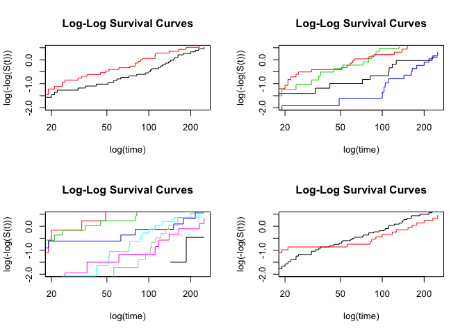
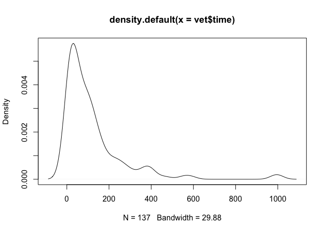
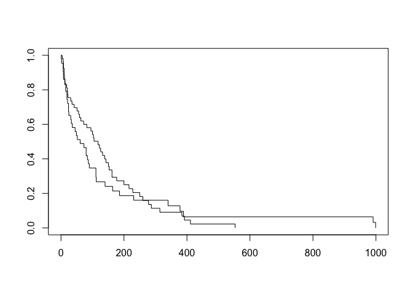
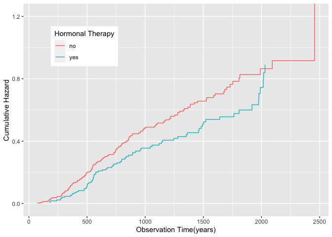

## PBC

    table(pbc$status)

    ## 
    ##   0   1   2 
    ## 232  25 161

    boxplot(time~status,data=pbc)

    # create survival time object
    pbc$T = Surv(time=pbc$time, event=pbc$status)

    ## Warning in Surv(time = pbc$time, event = pbc$status): Invalid status value,
    ## converted to NA

    km = survfit(T~trt, data=pbc)
    # km curve
    print(km)

    ## Call: survfit(formula = T ~ trt, data = pbc)
    ## 
    ##    274 observations deleted due to missingness 
    ##        n events median 0.95LCL 0.95UCL
    ## trt=1 75     65   1434    1170    1925
    ## trt=2 69     60   1217     890    1847

    plot(km, col=c('blue','red'), xlab='Time', ylab='Survival Probability', main='Kaplan Meier Curves')

    # cox ph model
    coxm1 = coxph(T~trt, data=pbc, ties='breslow')
    summary(coxm1)

    ## Call:
    ## coxph(formula = T ~ trt, data = pbc, ties = "breslow")
    ## 
    ##   n= 144, number of events= 125 
    ##    (274 observations deleted due to missingness)
    ## 
    ##        coef exp(coef) se(coef)     z Pr(>|z|)
    ## trt 0.01776   1.01792  0.18176 0.098    0.922
    ## 
    ##     exp(coef) exp(-coef) lower .95 upper .95
    ## trt     1.018     0.9824    0.7129     1.454
    ## 
    ## Concordance= 0.52  (se = 0.026 )
    ## Likelihood ratio test= 0.01  on 1 df,   p=0.9
    ## Wald test            = 0.01  on 1 df,   p=0.9
    ## Score (logrank) test = 0.01  on 1 df,   p=0.9

## Veteran ranger package

In this demo we’re using ‘veteran’ data from survival package, which
records data of randomized trial of two treatment regimens for lung
cancer.

trt: 1=standard 2=test celltype: 1=squamous, 2=smallcell, 3=adeno,
4=large time: survival time status: censoring status karno: Karnofsky
performance score (100=good) diagtime: months from diagnosis to
randomisation age: in years prior: prior therapy 0=no, 10=yes

    library(survival)
    library(data.table)
    library(ranger)

    ## Warning: package 'ranger' was built under R version 3.6.2

    library(caret)

    ## Loading required package: lattice

    ## Loading required package: ggplot2

    ## Warning: package 'ggplot2' was built under R version 3.6.2

    ## 
    ## Attaching package: 'caret'

    ## The following object is masked from 'package:survival':
    ## 
    ##     cluster

    set.seed(19880303)

    data(veteran)

    ## Warning in data(veteran): data set 'veteran' not found

    vet = veteran
    head(vet)

    ##   trt celltype time status karno diagtime age prior
    ## 1   1 squamous   72      1    60        7  69     0
    ## 2   1 squamous  411      1    70        5  64    10
    ## 3   1 squamous  228      1    60        3  38     0
    ## 4   1 squamous  126      1    60        9  63    10
    ## 5   1 squamous  118      1    70       11  65    10
    ## 6   1 squamous   10      1    20        5  49     0

    vet$T = Surv(time=vet$time, event=vet$status)

    dim(dt)

    ## NULL

    dt <- data.table(veteran)
    # dt[,9] = Surv(time=vet$time, event=vet$status)

    rm(veteran)

    ## Warning in rm(veteran): object 'veteran' not found

    # plot survival curve:
    dim(dt)

    ## [1] 137   8

    kmvet = survfit(T~trt, data=vet)
    # km curve
    print(kmvet)

    ## Call: survfit(formula = T ~ trt, data = vet)
    ## 
    ##        n events median 0.95LCL 0.95UCL
    ## trt=1 69     64  103.0      59     132
    ## trt=2 68     64   52.5      44      95

    plot(kmvet, col=c('blue','red'), xlab='Time', ylab='Survival Probability', main='Kaplan Meier Curves')
    legend("topright", lwd = 1, col = c('blue','red'), cex=0.7, y.intersp = 0.5,
           legend = c('trt=1', 'trt=2'))
    abline(h=0.5,lty=3)

    # Next, we split the data in a training and test set.
    ind <- sample(1:nrow(dt),round(nrow(dt) * 0.7,0))
    dt_train <- dt[ind,]
    dt_test <- dt[!ind,]
    dim(dt_train)

    ## [1] 96  8

    dim(dt_test)

    ## [1] 41  8

    vet.tr = vet[ind,]
    vet.te = vet[-ind,]

    ########################################  COX PH ####################################
    coxm0 = coxph(T~(celltype+trt+karno+diagtime+age+prior)^2, data=vet.tr, ties='breslow')
    coxph(Surv(time,status)~(celltype+trt+karno+diagtime+age+prior)^2, data=dt_train, ties='breslow')

    ## Call:
    ## coxph(formula = Surv(time, status) ~ (celltype + trt + karno + 
    ##     diagtime + age + prior)^2, data = dt_train, ties = "breslow")
    ## 
    ##                                  coef  exp(coef)   se(coef)      z      p
    ## celltypesmallcell           6.797e-01  1.973e+00  2.793e+00  0.243 0.8077
    ## celltypeadeno               5.228e+00  1.864e+02  4.029e+00  1.297 0.1945
    ## celltypelarge              -3.107e+00  4.473e-02  3.642e+00 -0.853 0.3935
    ## trt                         1.638e+00  5.147e+00  2.618e+00  0.626 0.5314
    ## karno                      -8.652e-02  9.171e-01  8.039e-02 -1.076 0.2818
    ## diagtime                    2.201e-02  1.022e+00  1.887e-01  0.117 0.9072
    ## age                        -7.750e-02  9.254e-01  8.859e-02 -0.875 0.3817
    ## prior                       7.522e-01  2.122e+00  3.011e-01  2.498 0.0125
    ## celltypesmallcell:trt       1.134e+00  3.110e+00  8.331e-01  1.362 0.1732
    ## celltypeadeno:trt           6.739e-01  1.962e+00  9.129e-01  0.738 0.4604
    ## celltypelarge:trt           1.189e+00  3.285e+00  9.907e-01  1.201 0.2299
    ## celltypesmallcell:karno     2.752e-02  1.028e+00  2.262e-02  1.217 0.2237
    ## celltypeadeno:karno         2.037e-02  1.021e+00  2.274e-02  0.896 0.3702
    ## celltypelarge:karno         4.175e-02  1.043e+00  2.774e-02  1.505 0.1323
    ## celltypesmallcell:diagtime -3.845e-02  9.623e-01  5.141e-02 -0.748 0.4545
    ## celltypeadeno:diagtime     -1.644e-01  8.484e-01  7.817e-02 -2.103 0.0354
    ## celltypelarge:diagtime      1.065e-01  1.112e+00  9.308e-02  1.144 0.2527
    ## celltypesmallcell:age      -5.379e-02  9.476e-01  3.388e-02 -1.588 0.1123
    ## celltypeadeno:age          -1.029e-01  9.022e-01  4.786e-02 -2.150 0.0316
    ## celltypelarge:age          -4.103e-02  9.598e-01  4.356e-02 -0.942 0.3462
    ## celltypesmallcell:prior     9.420e-02  1.099e+00  9.892e-02  0.952 0.3409
    ## celltypeadeno:prior         2.912e-01  1.338e+00  1.148e-01  2.537 0.0112
    ## celltypelarge:prior         6.179e-02  1.064e+00  8.692e-02  0.711 0.4771
    ## trt:karno                  -4.296e-02  9.579e-01  1.828e-02 -2.351 0.0187
    ## trt:diagtime                5.849e-02  1.060e+00  5.118e-02  1.143 0.2530
    ## trt:age                     1.240e-02  1.012e+00  3.446e-02  0.360 0.7190
    ## trt:prior                  -1.686e-01  8.448e-01  8.335e-02 -2.023 0.0431
    ## karno:diagtime             -2.229e-03  9.978e-01  2.009e-03 -1.109 0.2673
    ## karno:age                   1.853e-03  1.002e+00  1.055e-03  1.755 0.0792
    ## karno:prior                -4.573e-03  9.954e-01  2.486e-03 -1.840 0.0658
    ## diagtime:age                4.235e-04  1.000e+00  2.366e-03  0.179 0.8579
    ## diagtime:prior              3.133e-03  1.003e+00  4.860e-03  0.645 0.5192
    ## age:prior                  -6.071e-03  9.939e-01  4.062e-03 -1.495 0.1350
    ## 
    ## Likelihood ratio test=89.44  on 33 df, p=4.204e-07
    ## n= 96, number of events= 89

    # 'best' model using backward selection
    coxm1 = step(coxm0, direction = "backward")

    ## Start:  AIC=618.43
    ## T ~ (celltype + trt + karno + diagtime + age + prior)^2
    ## 
    ##                     Df    AIC
    ## - celltype:trt       3 614.75
    ## - celltype:karno     3 615.14
    ## - diagtime:age       1 616.46
    ## - trt:age            1 616.56
    ## - diagtime:prior     1 616.85
    ## - celltype:age       3 617.45
    ## - karno:diagtime     1 617.67
    ## - trt:diagtime       1 617.74
    ## - celltype:prior     3 617.84
    ## <none>                 618.43
    ## - age:prior          1 618.66
    ## - celltype:diagtime  3 619.27
    ## - karno:age          1 619.52
    ## - karno:prior        1 619.95
    ## - trt:prior          1 620.69
    ## - trt:karno          1 622.11
    ## 
    ## Step:  AIC=614.75
    ## T ~ celltype + trt + karno + diagtime + age + prior + celltype:karno + 
    ##     celltype:diagtime + celltype:age + celltype:prior + trt:karno + 
    ##     trt:diagtime + trt:age + trt:prior + karno:diagtime + karno:age + 
    ##     karno:prior + diagtime:age + diagtime:prior + age:prior
    ## 
    ##                     Df    AIC
    ## - celltype:karno     3 610.44
    ## - diagtime:age       1 612.84
    ## - diagtime:prior     1 613.08
    ## - trt:age            1 613.23
    ## - karno:diagtime     1 613.41
    ## - celltype:prior     3 613.96
    ## - age:prior          1 614.04
    ## - celltype:age       3 614.26
    ## <none>                 614.75
    ## - trt:diagtime       1 615.25
    ## - celltype:diagtime  3 615.86
    ## - karno:prior        1 617.10
    ## - karno:age          1 617.72
    ## - trt:karno          1 618.48
    ## - trt:prior          1 618.88
    ## 
    ## Step:  AIC=610.44
    ## T ~ celltype + trt + karno + diagtime + age + prior + celltype:diagtime + 
    ##     celltype:age + celltype:prior + trt:karno + trt:diagtime + 
    ##     trt:age + trt:prior + karno:diagtime + karno:age + karno:prior + 
    ##     diagtime:age + diagtime:prior + age:prior
    ## 
    ##                     Df    AIC
    ## - diagtime:age       1 608.62
    ## - diagtime:prior     1 608.81
    ## - karno:diagtime     1 608.96
    ## - trt:age            1 609.42
    ## - age:prior          1 609.63
    ## - celltype:prior     3 609.65
    ## <none>                 610.44
    ## - celltype:age       3 610.48
    ## - trt:diagtime       1 611.36
    ## - celltype:diagtime  3 612.29
    ## - karno:age          1 612.79
    ## - karno:prior        1 613.40
    ## - trt:prior          1 614.53
    ## - trt:karno          1 616.42
    ## 
    ## Step:  AIC=608.62
    ## T ~ celltype + trt + karno + diagtime + age + prior + celltype:diagtime + 
    ##     celltype:age + celltype:prior + trt:karno + trt:diagtime + 
    ##     trt:age + trt:prior + karno:diagtime + karno:age + karno:prior + 
    ##     diagtime:prior + age:prior
    ## 
    ##                     Df    AIC
    ## - diagtime:prior     1 607.02
    ## - karno:diagtime     1 607.22
    ## - trt:age            1 607.55
    ## - celltype:prior     3 608.04
    ## - celltype:age       3 608.52
    ## <none>                 608.62
    ## - age:prior          1 609.11
    ## - trt:diagtime       1 609.99
    ## - celltype:diagtime  3 610.47
    ## - karno:age          1 611.12
    ## - karno:prior        1 611.53
    ## - trt:prior          1 613.07
    ## - trt:karno          1 614.48
    ## 
    ## Step:  AIC=607.02
    ## T ~ celltype + trt + karno + diagtime + age + prior + celltype:diagtime + 
    ##     celltype:age + celltype:prior + trt:karno + trt:diagtime + 
    ##     trt:age + trt:prior + karno:diagtime + karno:age + karno:prior + 
    ##     age:prior
    ## 
    ##                     Df    AIC
    ## - trt:age            1 605.65
    ## - karno:diagtime     1 606.24
    ## - celltype:prior     3 606.67
    ## - celltype:age       3 606.93
    ## <none>                 607.02
    ## - age:prior          1 607.19
    ## - trt:diagtime       1 608.06
    ## - celltype:diagtime  3 608.94
    ## - karno:age          1 609.16
    ## - karno:prior        1 609.70
    ## - trt:prior          1 611.12
    ## - trt:karno          1 612.95
    ## 
    ## Step:  AIC=605.65
    ## T ~ celltype + trt + karno + diagtime + age + prior + celltype:diagtime + 
    ##     celltype:age + celltype:prior + trt:karno + trt:diagtime + 
    ##     trt:prior + karno:diagtime + karno:age + karno:prior + age:prior
    ## 
    ##                     Df    AIC
    ## - celltype:age       3 604.99
    ## - karno:diagtime     1 605.15
    ## - age:prior          1 605.47
    ## <none>                 605.65
    ## - celltype:prior     3 605.74
    ## - trt:diagtime       1 606.96
    ## - karno:age          1 607.17
    ## - celltype:diagtime  3 607.61
    ## - karno:prior        1 607.94
    ## - trt:prior          1 610.52
    ## - trt:karno          1 612.20
    ## 
    ## Step:  AIC=604.99
    ## T ~ celltype + trt + karno + diagtime + age + prior + celltype:diagtime + 
    ##     celltype:prior + trt:karno + trt:diagtime + trt:prior + karno:diagtime + 
    ##     karno:age + karno:prior + age:prior
    ## 
    ##                     Df    AIC
    ## - celltype:prior     3 603.01
    ## - age:prior          1 603.64
    ## - karno:diagtime     1 604.67
    ## <none>                 604.99
    ## - karno:age          1 605.20
    ## - celltype:diagtime  3 605.44
    ## - trt:diagtime       1 607.33
    ## - karno:prior        1 607.43
    ## - trt:prior          1 610.49
    ## - trt:karno          1 611.33
    ## 
    ## Step:  AIC=603.01
    ## T ~ celltype + trt + karno + diagtime + age + prior + celltype:diagtime + 
    ##     trt:karno + trt:diagtime + trt:prior + karno:diagtime + karno:age + 
    ##     karno:prior + age:prior
    ## 
    ##                     Df    AIC
    ## - celltype:diagtime  3 601.56
    ## - age:prior          1 601.68
    ## - karno:diagtime     1 602.43
    ## <none>                 603.01
    ## - karno:age          1 603.26
    ## - trt:diagtime       1 604.93
    ## - karno:prior        1 606.00
    ## - trt:karno          1 607.33
    ## - trt:prior          1 609.11
    ## 
    ## Step:  AIC=601.56
    ## T ~ celltype + trt + karno + diagtime + age + prior + trt:karno + 
    ##     trt:diagtime + trt:prior + karno:diagtime + karno:age + karno:prior + 
    ##     age:prior
    ## 
    ##                  Df    AIC
    ## - age:prior       1 600.26
    ## - karno:age       1 600.89
    ## <none>              601.56
    ## - trt:diagtime    1 601.67
    ## - karno:prior     1 602.65
    ## - karno:diagtime  1 602.68
    ## - trt:karno       1 604.98
    ## - celltype        3 605.08
    ## - trt:prior       1 605.17
    ## 
    ## Step:  AIC=600.26
    ## T ~ celltype + trt + karno + diagtime + age + prior + trt:karno + 
    ##     trt:diagtime + trt:prior + karno:diagtime + karno:age + karno:prior
    ## 
    ##                  Df    AIC
    ## - karno:age       1 599.43
    ## <none>              600.26
    ## - trt:diagtime    1 600.46
    ## - karno:prior     1 601.36
    ## - karno:diagtime  1 601.45
    ## - trt:prior       1 603.18
    ## - trt:karno       1 603.86
    ## - celltype        3 604.14
    ## 
    ## Step:  AIC=599.43
    ## T ~ celltype + trt + karno + diagtime + age + prior + trt:karno + 
    ##     trt:diagtime + trt:prior + karno:diagtime + karno:prior
    ## 
    ##                  Df    AIC
    ## - age             1 597.64
    ## - trt:diagtime    1 599.26
    ## <none>              599.43
    ## - karno:prior     1 600.52
    ## - karno:diagtime  1 600.68
    ## - trt:prior       1 601.96
    ## - celltype        3 602.46
    ## - trt:karno       1 602.55
    ## 
    ## Step:  AIC=597.64
    ## T ~ celltype + trt + karno + diagtime + prior + trt:karno + trt:diagtime + 
    ##     trt:prior + karno:diagtime + karno:prior
    ## 
    ##                  Df    AIC
    ## - trt:diagtime    1 597.39
    ## <none>              597.64
    ## - karno:prior     1 598.75
    ## - karno:diagtime  1 598.85
    ## - trt:prior       1 600.05
    ## - celltype        3 600.49
    ## - trt:karno       1 601.14
    ## 
    ## Step:  AIC=597.39
    ## T ~ celltype + trt + karno + diagtime + prior + trt:karno + trt:prior + 
    ##     karno:diagtime + karno:prior
    ## 
    ##                  Df    AIC
    ## <none>              597.39
    ## - trt:prior       1 598.12
    ## - karno:prior     1 598.29
    ## - karno:diagtime  1 599.31
    ## - celltype        3 601.72
    ## - trt:karno       1 601.73

    summary(coxm1)

    ## Call:
    ## coxph(formula = T ~ celltype + trt + karno + diagtime + prior + 
    ##     trt:karno + trt:prior + karno:diagtime + karno:prior, data = vet.tr, 
    ##     ties = "breslow")
    ## 
    ##   n= 96, number of events= 89 
    ## 
    ##                        coef exp(coef)  se(coef)      z Pr(>|z|)    
    ## celltypesmallcell  0.807070  2.241330  0.367791  2.194 0.028209 *  
    ## celltypeadeno      1.014113  2.756916  0.380909  2.662 0.007760 ** 
    ## celltypelarge      0.217176  1.242563  0.358371  0.606 0.544509    
    ## trt                2.871312 17.660167  0.871335  3.295 0.000983 ***
    ## karno              0.040004  1.040815  0.025182  1.589 0.112152    
    ## diagtime           0.156593  1.169520  0.070286  2.228 0.025884 *  
    ## prior              0.320328  1.377580  0.137985  2.321 0.020261 *  
    ## trt:karno         -0.034348  0.966235  0.013634 -2.519 0.011759 *  
    ## trt:prior         -0.084865  0.918636  0.052093 -1.629 0.103286    
    ## karno:diagtime    -0.002618  0.997385  0.001382 -1.895 0.058087 .  
    ## karno:prior       -0.003325  0.996681  0.001953 -1.702 0.088709 .  
    ## ---
    ## Signif. codes:  0 '***' 0.001 '**' 0.01 '*' 0.05 '.' 0.1 ' ' 1
    ## 
    ##                   exp(coef) exp(-coef) lower .95 upper .95
    ## celltypesmallcell    2.2413    0.44616    1.0900    4.6086
    ## celltypeadeno        2.7569    0.36272    1.3068    5.8164
    ## celltypelarge        1.2426    0.80479    0.6156    2.5082
    ## trt                 17.6602    0.05662    3.2012   97.4264
    ## karno                1.0408    0.96079    0.9907    1.0935
    ## diagtime             1.1695    0.85505    1.0190    1.3423
    ## prior                1.3776    0.72591    1.0511    1.8054
    ## trt:karno            0.9662    1.03494    0.9408    0.9924
    ## trt:prior            0.9186    1.08857    0.8295    1.0174
    ## karno:diagtime       0.9974    1.00262    0.9947    1.0001
    ## karno:prior          0.9967    1.00333    0.9929    1.0005
    ## 
    ## Concordance= 0.746  (se = 0.027 )
    ## Likelihood ratio test= 66.48  on 11 df,   p=6e-10
    ## Wald test            = 61.46  on 11 df,   p=5e-09
    ## Score (logrank) test = 68.78  on 11 df,   p=2e-10

    # coxph(formula = T ~ celltype + trt + karno + diagtime + age + 
    #     prior + celltype:diagtime + trt:karno + trt:prior + karno:diagtime + 
    #     karno:age, data = vet.tr, ties = "breslow")

    # PH assumption: non-parallel, violated
    par(mfrow=c(2,2))
    sapply(list(vet.tr$trt, vet.tr$celltype, vet.tr$karno, vet.tr$prior), 
           function(var) plot(survfit(T ~ var, data=vet.tr),
                              col=1:10,
                              fun="cloglog",
                              ylab='log(-log(S(t)))', 
                              xlab='log(time)',
                              xlim=c(20,250),
                              ylim=c(-2,0.5),
                              main='Log-Log Survival Curves')
    )

    ##   [,1]      [,2]      [,3]      [,4]     
    ## x Numeric,2 Numeric,4 Numeric,9 Numeric,2
    ## y Numeric,2 Numeric,4 Numeric,9 Numeric,2

    par(mfrow=c(1,1))

    # by trt: In the goodness of fit test based on Schoenfeld Residuals, we reject the null. So the proportional hazard assumption is violated.
    cox.zph(coxm1)

    ##                   chisq df       p
    ## celltype       12.41981  3 0.00608
    ## trt             0.96380  1 0.32623
    ## karno           7.12887  1 0.00759
    ## diagtime        0.01070  1 0.91761
    ## prior           0.44435  1 0.50503
    ## trt:karno       3.52340  1 0.06051
    ## trt:prior       0.97500  1 0.32344
    ## karno:diagtime  1.83565  1 0.17546
    ## karno:prior     0.00965  1 0.92176
    ## GLOBAL         36.51023 11 0.00014

    # not useful
    plot(density(vet$time))

Use ranger package to train the random survival models.

First find the optimal mtry parameter that gives the smallest OOB error.
Over 1000 iterations, m = 3 has the highest frequency of giving the
smallest OOB error.

    ########################################  Ranger #############################################
    # find best m:
    functune = function(m){
      sapply(1:6, function(m) ranger(Surv(time, status) ~ .,
                    data = dt_train,
                    mtry = m,
                    verbose = TRUE,
                    write.forest=TRUE,
                    num.trees= 1000,
                    importance = 'permutation')$prediction.error)
    }
    # findM = apply(replicate(100,functune()), 2, which.min)
    # save(findM, file='findM')
    load(file='findM')
    table(findM) # m = 3

    ## findM
    ##  3  4  5  6 
    ## 35 29 20 16

    # fit random survival tree
    r_fit <- ranger(Surv(time, status) ~ .,
                    data = dt_train,
                    mtry = 3,
                    verbose = TRUE,
                    write.forest=TRUE,
                    num.trees= 1000,
                    importance = 'permutation')

    # distinct survival time in training data
    r_fit$unique.death.times 

    ##  [1]   1   2   4   7   8  10  11  12  13  15  18  19  20  21  22  24  25  31  33
    ## [20]  35  36  42  45  49  51  52  56  59  61  63  72  73  80  82  84  87  90  95
    ## [39] 100 103 105 111 112 118 122 123 126 132 139 140 143 151 153 162 164 177 182
    ## [58] 186 200 216 228 231 250 260 278 287 314 340 378 384 389 392 411 553 991 999

    # fitted survival: survival probability
    # rows represent individual patient; columns represent event time points
    fit.surv = r_fit$survival
    # dim(fit.surv)

    # sample 3 individuals to plot fitted survival curve
    par(mfrow=c(1,1))
    set.seed(12345)
    individual = sample(1:dim(dt_train)[1], 4)
    plot(r_fit$unique.death.times, fit.surv[individual[1],], type = 'l', col = 'red',xlab='Time', ylab='Survival Probability')
    lines(r_fit$unique.death.times,fit.surv[individual[2],], type = 'l', col = 'blue',xlab='Time', ylab='Survival Probability')
    lines(r_fit$unique.death.times,fit.surv[individual[3],], type = 'l', col = 'green',xlab='Time', ylab='Survival Probability')
    lines(r_fit$unique.death.times,fit.surv[individual[4],], type = 'l', col = 'pink',xlab='Time', ylab='Survival Probability')
    abline(v=dt_train[individual,]$time, lty=3, col=c('red','blue','green','pink'))
    legend("topright", lwd = 1, col = c('red','blue','green','pink'),
           legend = c('id14', 'id51', 'id80', 'id90'))

    dt_train[individual,]

    ##    trt  celltype time status karno diagtime age prior
    ## 1:   2  squamous  389      1    90        2  62     0
    ## 2:   2 smallcell    8      1    80        2  68     0
    ## 3:   1  squamous   11      1    70       11  48    10
    ## 4:   2     large  111      1    60        5  64     0

    plot(survfit(T ~ trt, data=vet.tr))

    # variable importance:
    r_fit$variable.importance

    ##          trt     celltype        karno     diagtime          age        prior 
    ##  0.001488535  0.016491644  0.094699116 -0.003539506 -0.002058161  0.001148779

    # In the following chunk of code, I calculate the accuracy of the model when it needs to predict survival after 61 days (this is purely arbitrary for demonstrational purposes).
    preds <- predict(r_fit, dt_test, type = 'response')$survival
    pred.surv <- data.table(preds)
    colnames(pred.surv) <- as.character(r_fit$unique.death.times)

    prediction <- pred.surv$`61` > 0.5
    real <- dt_test$time >= 61
    # confusion matrix:
    table(prediction, real)

    ##           real
    ## prediction FALSE TRUE
    ##      FALSE    11    3
    ##      TRUE     12   15

## GBSG2

<https://rdrr.io/cran/TH.data/man/GBSG2.html>

A data frame containing the observations from the GBSG2 study.

This data frame contains the observations of 686 women:

horTh hormonal therapy, a factor at two levels no and yes. age of the
patients in years. menostat menopausal status, a factor at two levels
pre (premenopausal) and post (postmenopausal). tsize tumor size (in mm).
tgrade tumor grade, a ordered factor at levels I &lt; II &lt; III.
pnodes number of positive nodes. progrec progesterone receptor (in
fmol). estrec estrogen receptor (in fmol). time recurrence free survival
time (in days). cens censoring indicator (0- censored, 1- event).

reference: <https://arxiv.org/pdf/1612.08974.pdf>

    ########################################  GBSG2:  #############################################
    # install.packages('ggRandomForest')
    library(ggRandomForests)

    ## Loading required package: randomForestSRC

    ## 
    ##  randomForestSRC 3.1.0 
    ##  
    ##  Type rfsrc.news() to see new features, changes, and bug fixes. 
    ## 

    ## Loading required package: randomForest

    ## randomForest 4.6-14

    ## Type rfNews() to see new features/changes/bug fixes.

    ## 
    ## Attaching package: 'randomForest'

    ## The following object is masked from 'package:ggplot2':
    ## 
    ##     margin

    ## The following object is masked from 'package:ranger':
    ## 
    ##     importance

    data("GBSG2", package = "TH.data")
    gbs = GBSG2
    # ?GBSG2
    head(gbs)

    ##   horTh age menostat tsize tgrade pnodes progrec estrec time cens
    ## 1    no  70     Post    21     II      3      48     66 1814    1
    ## 2   yes  56     Post    12     II      7      61     77 2018    1
    ## 3   yes  58     Post    35     II      9      52    271  712    1
    ## 4   yes  59     Post    17     II      4      60     29 1807    1
    ## 5    no  73     Post    35     II      1      26     65  772    1
    ## 6    no  32      Pre    57    III     24       0     13  448    1

    dim(gbs)[1]

    ## [1] 686

    set.seed(999)
    tidx = sample(1:dim(gbs)[1], floor(dim(gbs)[1]*0.25))
    gbs.train = gbs[-tidx,]
    gbs.test = gbs[tidx,]
    # create survival object 
    gg_dta <- gg_survival(interval = "time",
                          censor = "cens",
                          by = "horTh",
                          data = gbs.train,
                          conf.int = 0.95 )

    # KM curve
    plot(gg_dta)+
      labs(y = "Survival Probability", x = "Observation Time", color = "Hormonal Therapy", fill = "Hormonal Therapy") +
      theme(legend.position = c(0.2,0.2))+
      coord_cartesian(y = c(0, 1.01))

    # Cumulative Hazard plot:
    plot(gg_dta, type ="cum_haz")+
      labs(y = "Cumulative Hazard", x = "Observation Time(years)", color = "Hormonal Therapy", fill = "Hormonal Therapy") +
      theme(legend.position = c(0.2, 0.8))+
      coord_cartesian( ylim = c(-0.02, 1.22))

    # grows the forest
    rfsrc.gbs <- rfsrc(Surv(time, cens) ~ ., data = gbs.train,
                         nsplit = 10, na.action = "na.impute",tree.err = TRUE, importance = TRUE)
    print.rfsrc(rfsrc.gbs)

    ##                          Sample size: 515
    ##                     Number of deaths: 229
    ##                      Number of trees: 500
    ##            Forest terminal node size: 15
    ##        Average no. of terminal nodes: 25.022
    ## No. of variables tried at each split: 3
    ##               Total no. of variables: 8
    ##        Resampling used to grow trees: swor
    ##     Resample size used to grow trees: 325
    ##                             Analysis: RSF
    ##                               Family: surv
    ##                       Splitting rule: logrank *random*
    ##        Number of random split points: 10
    ##                           (OOB) CRPS: 0.16630572
    ##    (OOB) Requested performance error: 0.33217686

    # plot OOB error
    plot(gg_error(rfsrc.gbs))

    # #对测试集的预测
    # predict.rfsrc(rfsrc_pbcmy, data = pbc.test)
    # predict.rfsrc(rfsrc_pbcmy, data = pbc.trial)
    # #VIMP法变量筛选
    # plot(gg_vimp(rfsrc_pbcmy))
    # #最小深度法变量筛选
    # varsel_pbc <- var.select(rfsrc_pbcmy)
    # gg_md <- gg_minimal_depth(varsel_pbc)
    # plot(gg_md)
    # #两种方法相结合的散点图
    # plot(gg_minimal_vimp(gg_md))+theme(legend.position = c(0.8,0.2))
    # plot(gg_minimal_vimp(rfsrc_pbcmy))+theme(legend.position = c(0.8,0.2))
    # gg_minimal_vimp(rfsrc_pbcmy)
