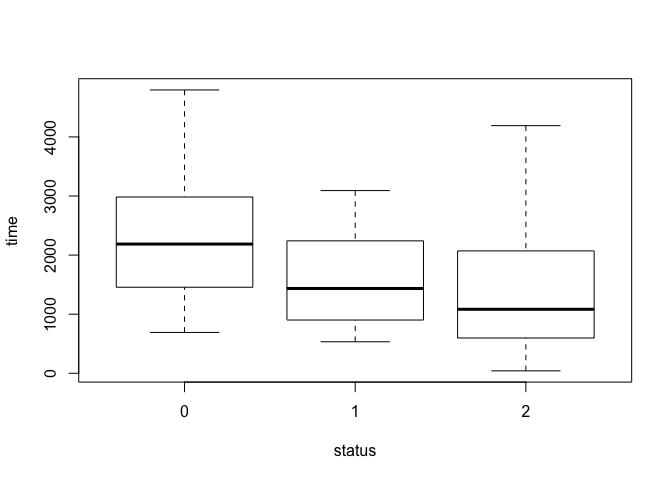
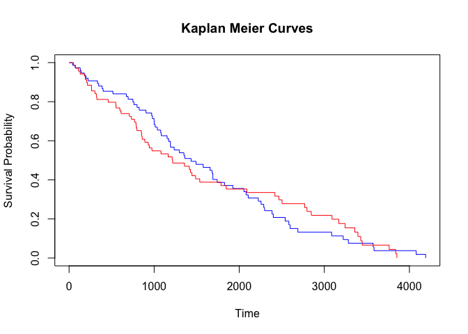
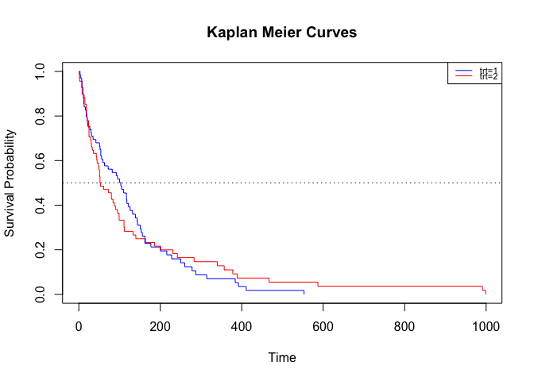
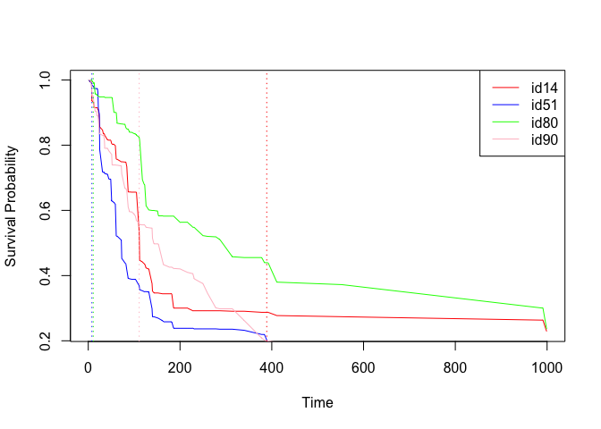
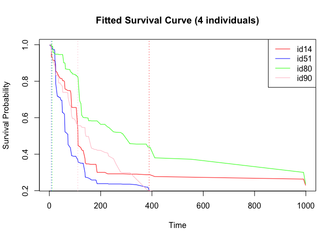
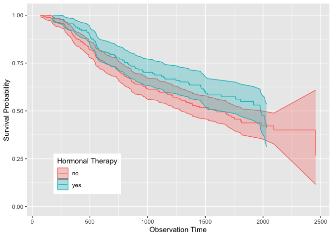
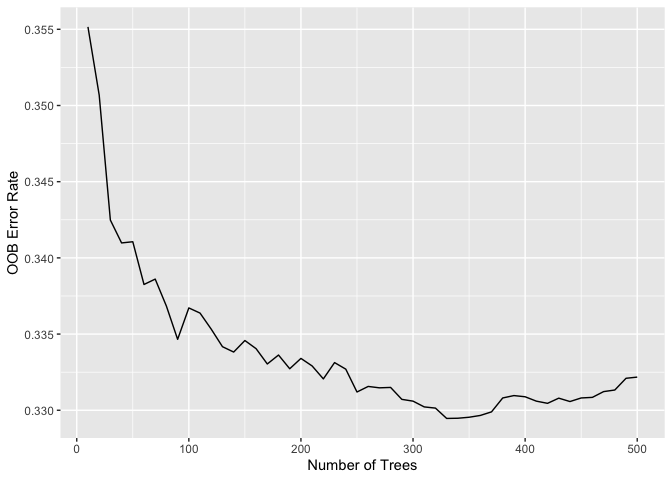

## PBC

    table(pbc$status)

    ## 
    ##   0   1   2 
    ## 232  25 161

    boxplot(time~status,data=pbc)

    # create survival time object
    pbc$T = Surv(time=pbc$time, event=pbc$status)

    ## Warning in Surv(time = pbc$time, event = pbc$status): Invalid status value,
    ## converted to NA

    km = survfit(T~trt, data=pbc)
    # km curve
    print(km)

    ## Call: survfit(formula = T ~ trt, data = pbc)
    ## 
    ##    274 observations deleted due to missingness 
    ##        n events median 0.95LCL 0.95UCL
    ## trt=1 75     65   1434    1170    1925
    ## trt=2 69     60   1217     890    1847

    plot(km, col=c('blue','red'), xlab='Time', ylab='Survival Probability', main='Kaplan Meier Curves')

    # cox ph model
    coxm1 = coxph(T~trt, data=pbc, ties='breslow')
    summary(coxm1)

    ## Call:
    ## coxph(formula = T ~ trt, data = pbc, ties = "breslow")
    ## 
    ##   n= 144, number of events= 125 
    ##    (274 observations deleted due to missingness)
    ## 
    ##        coef exp(coef) se(coef)     z Pr(>|z|)
    ## trt 0.01776   1.01792  0.18176 0.098    0.922
    ## 
    ##     exp(coef) exp(-coef) lower .95 upper .95
    ## trt     1.018     0.9824    0.7129     1.454
    ## 
    ## Concordance= 0.52  (se = 0.026 )
    ## Likelihood ratio test= 0.01  on 1 df,   p=0.9
    ## Wald test            = 0.01  on 1 df,   p=0.9
    ## Score (logrank) test = 0.01  on 1 df,   p=0.9

## Veteran ranger package

In this demo we’re using ‘veteran’ data from survival package, which
records data of randomized trial of two treatment regimens for lung
cancer.

trt: 1=standard 2=test celltype: 1=squamous, 2=smallcell, 3=adeno,
4=large time: survival time status: censoring status karno: Karnofsky
performance score (100=good) diagtime: months from diagnosis to
randomisation age: in years prior: prior therapy 0=no, 10=yes

    library(survival)
    library(data.table)
    library(ranger)

    ## Warning: package 'ranger' was built under R version 3.6.2

    library(caret)

    ## Loading required package: lattice

    ## Loading required package: ggplot2

    ## Warning: package 'ggplot2' was built under R version 3.6.2

    ## 
    ## Attaching package: 'caret'

    ## The following object is masked from 'package:survival':
    ## 
    ##     cluster

    set.seed(19880303)

    data(veteran)

    ## Warning in data(veteran): data set 'veteran' not found

    vet = veteran
    head(vet)

    ##   trt celltype time status karno diagtime age prior
    ## 1   1 squamous   72      1    60        7  69     0
    ## 2   1 squamous  411      1    70        5  64    10
    ## 3   1 squamous  228      1    60        3  38     0
    ## 4   1 squamous  126      1    60        9  63    10
    ## 5   1 squamous  118      1    70       11  65    10
    ## 6   1 squamous   10      1    20        5  49     0

    vet$T = Surv(time=vet$time, event=vet$status)

    dim(dt)

    ## NULL

    dt <- data.table(veteran)
    # dt[,9] = Surv(time=vet$time, event=vet$status)

    rm(veteran)

    ## Warning in rm(veteran): object 'veteran' not found

    # plot survival curve:
    dim(dt)

    ## [1] 137   8

    kmvet = survfit(T~trt, data=vet)
    # km curve
    print(kmvet)

    ## Call: survfit(formula = T ~ trt, data = vet)
    ## 
    ##        n events median 0.95LCL 0.95UCL
    ## trt=1 69     64  103.0      59     132
    ## trt=2 68     64   52.5      44      95

    plot(kmvet, col=c('blue','red'), xlab='Time', ylab='Survival Probability', main='Kaplan Meier Curves')
    legend("topright", lwd = 1, col = c('blue','red'), cex=0.7, y.intersp = 0.5,
           legend = c('trt=1', 'trt=2'))
    abline(h=0.5,lty=3)

    # Next, we split the data in a training and test set.
    ind <- sample(1:nrow(dt),round(nrow(dt) * 0.7,0))
    dt_train <- dt[ind,]
    dt_test <- dt[!ind,]
    dim(dt_train)

    ## [1] 96  8

    dim(dt_test)

    ## [1] 41  8

    vet.tr = vet[ind,]
    vet.te = vet[-ind,]

### Cox PH

    ########################################  COX PH ####################################
    coxm0 = coxph(T~(celltype+trt+karno+diagtime+age+prior)^2, data=vet.tr, ties='breslow')
    # coxm1 = step(coxm0, direction = "backward")

    # model selected from backward selection
    coxm1 = coxph(formula = T ~ celltype + trt + karno + diagtime + age +
        prior + celltype:diagtime + trt:karno + trt:prior + karno:diagtime +
        karno:age, data = vet.tr, ties = "breslow")
    summary(coxm1)

    ## Call:
    ## coxph(formula = T ~ celltype + trt + karno + diagtime + age + 
    ##     prior + celltype:diagtime + trt:karno + trt:prior + karno:diagtime + 
    ##     karno:age, data = vet.tr, ties = "breslow")
    ## 
    ##   n= 96, number of events= 89 
    ## 
    ##                                  coef  exp(coef)   se(coef)      z Pr(>|z|)    
    ## celltypesmallcell           1.1808746  3.2572216  0.5288151  2.233 0.025545 *  
    ## celltypeadeno               1.1057854  3.0215966  0.5466754  2.023 0.043099 *  
    ## celltypelarge              -0.1773075  0.8375222  0.6077542 -0.292 0.770484    
    ## trt                         3.3578604 28.7276596  0.9487714  3.539 0.000401 ***
    ## karno                       0.0060854  1.0061040  0.0444043  0.137 0.890994    
    ## diagtime                    0.2298516  1.2584133  0.0638947  3.597 0.000321 ***
    ## age                        -0.0543316  0.9471180  0.0389877 -1.394 0.163451    
    ## prior                       0.1551472  1.1678298  0.0813443  1.907 0.056483 .  
    ## celltypesmallcell:diagtime -0.0222352  0.9780102  0.0363087 -0.612 0.540278    
    ## celltypeadeno:diagtime      0.0165295  1.0166669  0.0486378  0.340 0.733970    
    ## celltypelarge:diagtime      0.0540930  1.0555827  0.0545976  0.991 0.321804    
    ## trt:karno                  -0.0421515  0.9587245  0.0149639 -2.817 0.004849 ** 
    ## trt:prior                  -0.1022290  0.9028228  0.0566884 -1.803 0.071333 .  
    ## karno:diagtime             -0.0040016  0.9960064  0.0013740 -2.912 0.003588 ** 
    ## karno:age                   0.0008406  1.0008410  0.0006728  1.249 0.211534    
    ## ---
    ## Signif. codes:  0 '***' 0.001 '**' 0.01 '*' 0.05 '.' 0.1 ' ' 1
    ## 
    ##                            exp(coef) exp(-coef) lower .95 upper .95
    ## celltypesmallcell             3.2572    0.30701    1.1554    9.1828
    ## celltypeadeno                 3.0216    0.33095    1.0349    8.8220
    ## celltypelarge                 0.8375    1.19400    0.2545    2.7562
    ## trt                          28.7277    0.03481    4.4741  184.4573
    ## karno                         1.0061    0.99393    0.9222    1.0976
    ## diagtime                      1.2584    0.79465    1.1103    1.4263
    ## age                           0.9471    1.05583    0.8774    1.0223
    ## prior                         1.1678    0.85629    0.9957    1.3697
    ## celltypesmallcell:diagtime    0.9780    1.02248    0.9108    1.0501
    ## celltypeadeno:diagtime        1.0167    0.98361    0.9242    1.1184
    ## celltypelarge:diagtime        1.0556    0.94734    0.9485    1.1748
    ## trt:karno                     0.9587    1.04305    0.9310    0.9873
    ## trt:prior                     0.9028    1.10764    0.8079    1.0089
    ## karno:diagtime                0.9960    1.00401    0.9933    0.9987
    ## karno:age                     1.0008    0.99916    0.9995    1.0022
    ## 
    ## Concordance= 0.756  (se = 0.024 )
    ## Likelihood ratio test= 66.75  on 15 df,   p=2e-08
    ## Wald test            = 60.83  on 15 df,   p=2e-07
    ## Score (logrank) test = 71.08  on 15 df,   p=3e-09

    # PH assumption: non-parallel, violated
    par(mfrow=c(2,2))
    sapply(list(vet.tr$trt, vet.tr$celltype, vet.tr$karno, vet.tr$prior), 
           function(var) plot(survfit(T ~ var, data=vet.tr),
                              col=1:10,
                              fun="cloglog",
                              ylab='log(-log(S(t)))', 
                              xlab='log(time)',
                              xlim=c(20,250),
                              ylim=c(-2,0.5),
                              main='Log-Log Survival Curves')
    )

    ##   [,1]      [,2]      [,3]      [,4]     
    ## x Numeric,2 Numeric,4 Numeric,9 Numeric,2
    ## y Numeric,2 Numeric,4 Numeric,9 Numeric,2

    par(mfrow=c(1,1))

    # In the goodness of fit test based on Schoenfeld Residuals, we reject the null. So the proportional hazard assumption is violated.
    cox.zph(coxm1)

    ##                     chisq df       p
    ## celltype          13.5633  3  0.0036
    ## trt                1.3374  1  0.2475
    ## karno              7.7990  1  0.0052
    ## diagtime           0.0137  1  0.9070
    ## age                0.2696  1  0.6036
    ## prior              2.2699  1  0.1319
    ## celltype:diagtime 12.9147  3  0.0048
    ## trt:karno          3.9616  1  0.0465
    ## trt:prior          2.8640  1  0.0906
    ## karno:diagtime     2.1409  1  0.1434
    ## karno:age          7.2808  1  0.0070
    ## GLOBAL            48.3207 15 2.3e-05

Use ranger package to train the random survival models.

First find the optimal mtry parameter that gives the smallest OOB error.
Over 1000 iterations, m = 3 has the highest frequency of giving the
smallest OOB error. Then fit random survival tree with m = 3. The model
gives the fitted survival probability in a table format, where rows
represent individual patient and columns represent event time points.
The variable importance obtained here is very similar to what Cox PH
model gave - cell type, treatment, karno, diagtime, age and prior are
all considered as important predictor of survival time, except that Cox
PH model is able to show interactions between the variables.

    ########################################  Ranger #############################################
    # find best m:
    functune = function(m){
      sapply(1:6, function(m) ranger(Surv(time, status) ~ .,
                    data = dt_train,
                    mtry = m,
                    verbose = TRUE,
                    write.forest=TRUE,
                    num.trees= 1000,
                    importance = 'permutation')$prediction.error)
    }
    # findM = apply(replicate(100,functune()), 2, which.min)
    # save(findM, file='findM')
    load(file='findM')
    table(findM) # m = 3

    ## findM
    ##  3  4  5  6 
    ## 35 29 20 16

    # fit random survival tree
    r_fit <- ranger(Surv(time, status) ~ .,
                    data = dt_train,
                    mtry = 3,
                    verbose = TRUE,
                    write.forest=TRUE,
                    num.trees= 1000,
                    importance = 'permutation')

    # distinct survival time in training data
    r_fit$unique.death.times 

    ##  [1]   1   2   4   7   8  10  11  12  13  15  18  19  20  21  22  24  25  31  33
    ## [20]  35  36  42  45  49  51  52  56  59  61  63  72  73  80  82  84  87  90  95
    ## [39] 100 103 105 111 112 118 122 123 126 132 139 140 143 151 153 162 164 177 182
    ## [58] 186 200 216 228 231 250 260 278 287 314 340 378 384 389 392 411 553 991 999

    # fitted survival: survival probability
    # rows represent individual patient; columns represent event time points
    fit.surv = r_fit$survival
    # dim(fit.surv)

    # sample 4 individuals to plot fitted survival curve
    par(mfrow=c(1,1))
    set.seed(12345)
    individual = sample(1:dim(dt_train)[1], 4)
    plot(r_fit$unique.death.times, fit.surv[individual[1],], type = 'l', col = 'red',xlab='Time', ylab='Survival Probability', main='Fitted Survival Curve (4 individuals)')
    lines(r_fit$unique.death.times,fit.surv[individual[2],], type = 'l', col = 'blue',xlab='Time', ylab='Survival Probability')
    lines(r_fit$unique.death.times,fit.surv[individual[3],], type = 'l', col = 'green',xlab='Time', ylab='Survival Probability')
    lines(r_fit$unique.death.times,fit.surv[individual[4],], type = 'l', col = 'pink',xlab='Time', ylab='Survival Probability')
    abline(v=dt_train[individual,]$time, lty=3, col=c('red','blue','green','pink'))
    legend("topright", lwd = 1, col = c('red','blue','green','pink'),
           legend = c('id14', 'id51', 'id80', 'id90'))

    dt_train[individual,]

    ##    trt  celltype time status karno diagtime age prior
    ## 1:   2  squamous  389      1    90        2  62     0
    ## 2:   2 smallcell    8      1    80        2  68     0
    ## 3:   1  squamous   11      1    70       11  48    10
    ## 4:   2     large  111      1    60        5  64     0

    # variable importance:
    r_fit$variable.importance

    ##          trt     celltype        karno     diagtime          age        prior 
    ##  0.001488535  0.016491644  0.094699116 -0.003539506 -0.002058161  0.001148779

    # In the following chunk of code, I calculate the accuracy of the model when it needs to predict survival after 61 days (this is purely arbitrary for demonstrational purposes).
    preds <- predict(r_fit, dt_test, type = 'response')$survival
    pred.surv <- data.table(preds)
    colnames(pred.surv) <- as.character(r_fit$unique.death.times)

    prediction <- pred.surv$`61` > 0.5
    real <- dt_test$time >= 61
    # confusion matrix:
    table(prediction, real)

    ##           real
    ## prediction FALSE TRUE
    ##      FALSE    11    3
    ##      TRUE     12   15

## GBSG2

<https://rdrr.io/cran/TH.data/man/GBSG2.html>

A data frame containing the observations from the GBSG2 study.

This data frame contains the observations of 686 women:

horTh hormonal therapy, a factor at two levels no and yes. age of the
patients in years. menostat menopausal status, a factor at two levels
pre (premenopausal) and post (postmenopausal). tsize tumor size (in mm).
tgrade tumor grade, a ordered factor at levels I &lt; II &lt; III.
pnodes number of positive nodes. progrec progesterone receptor (in
fmol). estrec estrogen receptor (in fmol). time recurrence free survival
time (in days). cens censoring indicator (0- censored, 1- event).

reference: <https://arxiv.org/pdf/1612.08974.pdf>

    ########################################  GBSG2:  #############################################
    # install.packages('ggRandomForest')
    library(ggRandomForests)

    ## Loading required package: randomForestSRC

    ## 
    ##  randomForestSRC 3.1.0 
    ##  
    ##  Type rfsrc.news() to see new features, changes, and bug fixes. 
    ## 

    ## Loading required package: randomForest

    ## randomForest 4.6-14

    ## Type rfNews() to see new features/changes/bug fixes.

    ## 
    ## Attaching package: 'randomForest'

    ## The following object is masked from 'package:ggplot2':
    ## 
    ##     margin

    ## The following object is masked from 'package:ranger':
    ## 
    ##     importance

    data("GBSG2", package = "TH.data")
    gbs = GBSG2
    # ?GBSG2
    head(gbs)

    ##   horTh age menostat tsize tgrade pnodes progrec estrec time cens
    ## 1    no  70     Post    21     II      3      48     66 1814    1
    ## 2   yes  56     Post    12     II      7      61     77 2018    1
    ## 3   yes  58     Post    35     II      9      52    271  712    1
    ## 4   yes  59     Post    17     II      4      60     29 1807    1
    ## 5    no  73     Post    35     II      1      26     65  772    1
    ## 6    no  32      Pre    57    III     24       0     13  448    1

    dim(gbs)[1]

    ## [1] 686

    set.seed(999)
    tidx = sample(1:dim(gbs)[1], floor(dim(gbs)[1]*0.25))
    gbs.train = gbs[-tidx,]
    gbs.test = gbs[tidx,]
    # create survival object 
    gg_dta <- gg_survival(interval = "time",
                          censor = "cens",
                          by = "horTh",
                          data = gbs.train,
                          conf.int = 0.95 )

    # KM curve
    plot(gg_dta)+
      labs(y = "Survival Probability", x = "Observation Time", color = "Hormonal Therapy", fill = "Hormonal Therapy") +
      theme(legend.position = c(0.2,0.2))+
      coord_cartesian(y = c(0, 1.01))

    # Cumulative Hazard plot:
    plot(gg_dta, type ="cum_haz")+
      labs(y = "Cumulative Hazard", x = "Observation Time(years)", color = "Hormonal Therapy", fill = "Hormonal Therapy") +
      theme(legend.position = c(0.2, 0.8))+
      coord_cartesian( ylim = c(-0.02, 1.22))

    # grows the forest
    rfsrc.gbs <- rfsrc(Surv(time, cens) ~ ., data = gbs.train,
                         nsplit = 10, na.action = "na.impute",tree.err = TRUE, importance = TRUE)
    print.rfsrc(rfsrc.gbs)

    ##                          Sample size: 515
    ##                     Number of deaths: 229
    ##                      Number of trees: 500
    ##            Forest terminal node size: 15
    ##        Average no. of terminal nodes: 25.022
    ## No. of variables tried at each split: 3
    ##               Total no. of variables: 8
    ##        Resampling used to grow trees: swor
    ##     Resample size used to grow trees: 325
    ##                             Analysis: RSF
    ##                               Family: surv
    ##                       Splitting rule: logrank *random*
    ##        Number of random split points: 10
    ##                           (OOB) CRPS: 0.16630572
    ##    (OOB) Requested performance error: 0.33217686

    # plot OOB error
    plot(gg_error(rfsrc.gbs))

    # #对测试集的预测
    # predict.rfsrc(rfsrc_pbcmy, data = pbc.test)
    # predict.rfsrc(rfsrc_pbcmy, data = pbc.trial)
    # #VIMP法变量筛选
    # plot(gg_vimp(rfsrc_pbcmy))
    # #最小深度法变量筛选
    # varsel_pbc <- var.select(rfsrc_pbcmy)
    # gg_md <- gg_minimal_depth(varsel_pbc)
    # plot(gg_md)
    # #两种方法相结合的散点图
    # plot(gg_minimal_vimp(gg_md))+theme(legend.position = c(0.8,0.2))
    # plot(gg_minimal_vimp(rfsrc_pbcmy))+theme(legend.position = c(0.8,0.2))
    # gg_minimal_vimp(rfsrc_pbcmy)
