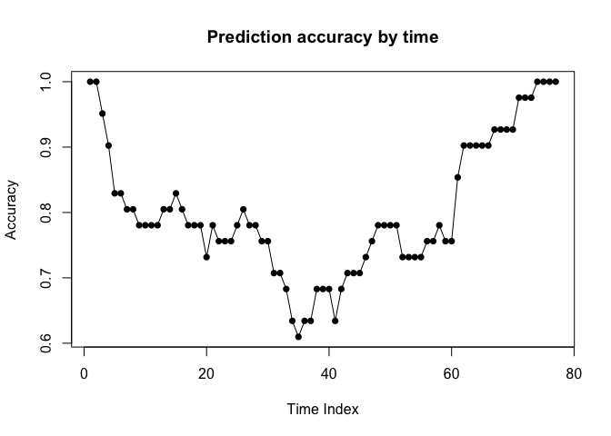

**Reference:**
<https://bmcmedresmethodol.biomedcentral.com/articles/10.1186/s12874-017-0383-8>

# Survival Analysis

## Survival Data

-   Goal:
    -   Assess the effect of risk factors on survival time - time until
        an event occurs, for example, death, diagnosis recovery, etc.
    -   Estimate and interpret survival
    -   Compare survival time / curve between groups
-   Outcome:
    -   The outcome of interest is a combination of continuous variable
        represents time to event and a binary variable represents
        censoring status: Y = \[T, C\]  
    -   T: Observed survival time
    -   C: Censoring (or event) status
-   Data snapshot:

## Censoring

Consider *Y**i*, *U**i* where *T**i* is
the time to event and *U**i* is time to censoring, i.e. end
of follow up period. We can only observe the minimum of the two time,
whichever comes the first,
*T**i* = *m**i**n*(*Y**i*,*U**i*).
Hence the actual exact survival time (T) is usually unknown, mainly due
to that the follow-up period is limited. Some instances are like when
there is no event happened up to the end of the follow-up period,
researchers lose contact with the patient, patient withdrawal
participation, or the exact date of the event is unknown. So we would
use censoring to account for the missing data issue. There are three
types of censoring:

-   Right censoring: *T* ≥ *T**E* Event happened after study
    period
-   Left censoring: *T* ≤ *T*0 Event happened before study
    period
-   Interval censoring: *T**A* ≤ *T* ≤ *T**B* Only
    know event time interval but don’t know the exact time

T: actual survival time  
*T*0: Start of study period  
*T**E*: End of study period

 *Image credit to
PHP2514 course material, Dr. Chrysanthopoulou*

For the Random Survival Forest method, we mainly focus on the
right-censoring data.

## Hazard Function

Survival analysis involves three characteristic functions: survival
function, hazard function, and cumulative hazard function, of which we
can derive all three given any one of the functions. The random survival
forest algorithm uses the cumulative hazard function. Hazard function
and cumulative hazard function are written as:

Hazard function (hazard rate): instantaneous potential per unit time for
the event to occur at time t, given survival up to time t:

<!-- $$h(t) = lim \Delta t \rightarrow 0 : \frac {P(t\leq T<t+\Delta t|T\geq t)} {\Delta(t)}$$ -->

 *Image credit to
PHP2514 course material, Dr. Chrysanthopoulou*

Cumulative Hazard Function: integrate hazard function h(t) from time 0
to time t

*H*(*t*) = ∫0*t**h*(*u*) *d**u*

# Regression Models for Survival Data

## Cox Porportional Hazards Model (semi-parametric)

-   Y: \[T, C\]
    -   T: Observed survival time
    -   C: Censoring (or event) status
-   Hazard rate:

Assume *h*0(*t*) as fixed and *X**j* are
**time-independent**:

$$h(t)=h\_0(t)e^{\\sum\_{j=1}^p\\beta\_jX\_j}$$

## PH assumption

Cox proportional hazards model is usually used for right censored
time-to-event data. Mode is convenient for flexibility and simplicity,
but it’s restricted to *proportional hazards (PH) assumptions*, which is
to assume hazard ratio as independent of time t (constant over time). In
other words, the hazard rate at any time point t for a set a covariate
X\* is **proportional** to the hazard rate at the same time point t for
other set of covariate X.

Hazard Ratio *θ* is defined as:

$$HR=\\frac{h(t,X^\*)}{h(t,X)}=e^{\\sum\_{j=1}^p\\beta\_j(X\_j^\*-X\_j)}=\\theta$$

Graphically, this is represented as roughly parallel survival curves
between different categories of a covariate. For example, the graph
below shows parallel pattern between high and low WBC, but non-parallel
between medium and the others.

## Survival Trees as alternative to Cox PH

When PH assumption is violated, which is most of the cases for real life
data, we turn to survival trees and Random survival forest (RSF) models
as alternative methods to the Cox PH model. (BMC Medical paper)

In contrast of the semi-parametric Cox PH model, survival trees is a
fully *non-parametric* method, which is much more flexible and can
easily handle high dimensional covariate data. And it can automatically
detect certain types of **interactions** without the need to specify
them beforehand. However, the drawback of survival trees is that it
tends to be biased towards inclusion of variables with many split
points.

### Conditional Inference Forest (CIF)\*:

“The random survival forests algorithm, has been criticised for having a
bias towards selecting variables with many split points and the
conditional inference forest algorithm has been identified as a method
to reduce this selection bias.”. As a further alternative to survival
trees, CIF is able to correct bias in RSF “by separating the algorithm
for selecting the best covariate to split on from that of the best split
point search” (BMC paper)

------------------------------------------------------------------------

# Survival Random Forest / Survival Tree

Idea: partitioning the covariate space recursively to form groups of
subjects who are similar according to the time-to-event outcome.
Minimizing a given impurity measure. Goal: To identify prognostic
factors that are predictive of the time-to-event outcome.

## Split Rules:

### The log-rank split-rule …

… The best split at a node h, on a covariate x at a split point s ∗ is
the one that gives the largest log-rank statistic between the two
daughter nodes ..

### The log-rank score split-rule …

… Trees are generally unstable and hence researchers have recommended
the growing of a collection of trees \[10, 27\], commonly referred to as
random survival forests \[20, 26\].

# Application in R

# Veteran Data

In this demo we’re using `veteran` data from `survival` package, which
records data of randomized trial of two treatment regimens for lung
cancer. For model fitting, we need `survival` library for cox ph model
and `ranger` library for random survival forest.

<table>
<caption>
Veteran Data
</caption>
<thead>
<tr>
<th style="text-align:left;">
Variable
</th>
<th style="text-align:left;">
Explanation
</th>
</tr>
</thead>
<tbody>
<tr>
<td style="text-align:left;">
trt:
</td>
<td style="text-align:left;">
1=standard 2=test
</td>
</tr>
<tr>
<td style="text-align:left;">
celltype:
</td>
<td style="text-align:left;">
1=squamous, 2=smallcell, 3=adeno, 4=large
</td>
</tr>
<tr>
<td style="text-align:left;">
time:
</td>
<td style="text-align:left;">
survival time
</td>
</tr>
<tr>
<td style="text-align:left;">
status:
</td>
<td style="text-align:left;">
censoring status
</td>
</tr>
<tr>
<td style="text-align:left;">
karno:
</td>
<td style="text-align:left;">
Karnofsky performance score (100=good)
</td>
</tr>
<tr>
<td style="text-align:left;">
diagtime:
</td>
<td style="text-align:left;">
months from diagnosis to randomisation
</td>
</tr>
<tr>
<td style="text-align:left;">
age:
</td>
<td style="text-align:left;">
in years
</td>
</tr>
<tr>
<td style="text-align:left;">
prior:
</td>
<td style="text-align:left;">
prior therapy 0=no, 10=yes
</td>
</tr>
</tbody>
</table>

First, we split data into training set and test set:

    library(survival)
    library(ranger)
    data(veteran)
    veteran <- data.table(veteran)
    vet = veteran

    # Next, we split the data in a training and test set.
    set.seed(123456)
    ind <- sample(1:nrow(veteran),round(nrow(veteran) * 0.7,0))
    veteran_train <- veteran[ind,]
    veteran_test <- veteran[!ind,]
    vet.tr = vet[ind,]
    vet.te = vet[-ind,]

Use Kaplan Meier Curve as a visual summary of the survival probability
between treatment groups:

    # plot survival curve:
    kmvet = survfit(Surv(time, status)~trt, data=vet)
    # km curve
    plot(kmvet, col=c('blue','red'), xlab='Time', ylab='Survival Probability', main='Kaplan Meier Curves')
    legend("topright", lwd = 1, col = c('blue','red'), cex=0.7, y.intersp = 0.5, legend = c('trt=1', 'trt=2'))
    abline(h=0.5,lty=3)

## Cox PH Model

We first fit a COX PH Model. Using backward selection, we found the
‘best’ variable to fit the data. However, the log-log survival curves
show non-parallel curves between variable groups. So the PH assumption
might be violated.

    coxm0 = coxph(Surv(time, status)~(celltype+trt+karno+diagtime+age+prior)^2, data=vet.tr, ties='breslow')
    # coxm1 = step(coxm0, direction = "backward")

    # model selected from backward selection
    coxm1 = coxph(formula = Surv(time, status) ~ celltype + trt + karno + diagtime + prior + 
        celltype:trt + trt:karno + trt:diagtime + trt:prior + karno:prior, data = vet.tr, ties = "breslow")
    # summary(coxm1)

    # PH assumption: non-parallel, violated
    par(mfrow=c(2,2))
    sapply(list(vet.tr$trt, vet.tr$celltype, vet.tr$karno, vet.tr$prior), 
           function(var) plot(survfit(Surv(time, status) ~ var, data=vet.tr),
                              col=1:10,
                              fun="cloglog",
                              ylab='log(-log(S(t)))', 
                              xlab='log(time)',
                              xlim=c(20,250),
                              ylim=c(-2,0.5),
                              main='Log-Log Survival Curves')
    )

The goodness of fit test based on Schoenfeld Residuals is another way to
test the PH assumption, which is the null hypothesis. However, we can
see a lot of p values of less than 0.05, this validated our concern that
the proportional hazard assumption is violated.

    cox.zph(coxm1) 

    ##                 chisq df     p
    ## celltype     7.59e+00  3 0.055
    ## trt          3.78e-05  1 0.995
    ## karno        5.35e+00  1 0.021
    ## diagtime     3.28e-01  1 0.567
    ## prior        4.62e-01  1 0.497
    ## celltype:trt 8.14e+00  3 0.043
    ## trt:karno    1.57e+00  1 0.211
    ## trt:diagtime 7.50e-01  1 0.387
    ## trt:prior    8.58e-01  1 0.354
    ## karno:prior  8.44e-02  1 0.771
    ## GLOBAL       2.22e+01 14 0.074

## Random Survival Models

### Use ranger package to train the random survival models

Recall that in random forest, we need to find number of variables **mtry
** to randomly select from at each node. First, we find the optimal mtry
parameter that gives the smallest OOB error. Over 1000 iterations, m = 3
has the highest frequency of giving the smallest OOB error.

    par(mfrow=c(1,1))
    # I created a simple function to find best m:
    functune = function(m){
      sapply(1:6, function(m) ranger(Surv(time, status) ~ .,
                    data = veteran_train,
                    mtry = m,
                    verbose = TRUE,
                    write.forest=TRUE,
                    num.trees= 1000,
                    importance = 'permutation')$prediction.error)
    }
    # I commented out this line of code to save running time: 
    # findM = apply(replicate(100,functune()), 2, which.min)
    # save(findM, file='findM')
    load(file='findM')
    # m = 3 is the optimal m
    table(findM)

    ## findM
    ##  3  4  5  6 
    ## 35 29 20 16

So we fit random survival tree with m = 3.

    # fit random survival tree
    r_fit <- ranger(Surv(time, status) ~ .,
                    data = veteran_train,
                    mtry = 3,
                    verbose = TRUE,
                    write.forest=TRUE,
                    num.trees= 1000,
                    importance = 'permutation')

### Fitted Survival probability

The model gives the fitted survival probability in a table format, where
rows represent individual patient and columns represent event time
points, from beginning to the end. Below I’m showing a snapshot of the
fitted survival probability table.

    # distinct survival time in training data
    # r_fit$unique.death.times

    # fitted survival: survival probability
    # rows represent individual patient; columns represent event time points
    fit.surv = r_fit$survival
    fit.survdf = data.frame(fit.surv)
    colnames(fit.survdf) <- paste0('T',as.character(r_fit$unique.death.times))
    # write.csv(fit.survdf, file = 'fit.survdf.csv')
    # fit.survdf = read.csv('fit.survdf.csv')
    fit.survdf[1:5,1:6]

    ##          T1        T2        T7        T8       T11       T12
    ## 1 0.9803422 0.9615677 0.8959521 0.8084944 0.8072767 0.8072767
    ## 2 0.9903623 0.9903623 0.9877519 0.9212304 0.9201504 0.9014983
    ## 3 0.9552650 0.8765003 0.8644494 0.7720116 0.7649667 0.7594641
    ## 4 0.9934633 0.9868441 0.9661402 0.9604876 0.9604876 0.9553862
    ## 5 0.9600375 0.9600375 0.9297039 0.8834538 0.8834538 0.8828354

Then I sampled 4 individuals to plot fitted survival curve.

    par(mfrow=c(1,1))
    set.seed(12345)
    individual = sample(1:dim(veteran_train)[1], 4)
    plot(r_fit$unique.death.times, fit.surv[individual[1],], type = 'l', col = 'red',xlab='Time', ylab='Survival Probability', main='Fitted Survival Curve (4 individuals)')
    lines(r_fit$unique.death.times,fit.surv[individual[2],], type = 'l', col = 'blue',xlab='Time', ylab='Survival Probability')
    lines(r_fit$unique.death.times,fit.surv[individual[3],], type = 'l', col = 'green',xlab='Time', ylab='Survival Probability')
    lines(r_fit$unique.death.times,fit.surv[individual[4],], type = 'l', col = 'pink',xlab='Time', ylab='Survival Probability')
    abline(v=veteran_train[individual,]$time, lty=3, col=c('red','blue','green','pink'))
    legend("topright", lwd = 1, col = c('red','blue','green','pink'),
           legend = c('id14', 'id51', 'id80', 'id90'))

    veteran_train[individual,]

    ##    trt  celltype time status karno diagtime age prior
    ## 1:   2 smallcell   21      1    20        4  71     0
    ## 2:   1     large  250      1    70        8  53    10
    ## 3:   2     large  378      1    80        4  65     0
    ## 4:   1  squamous  314      1    50       18  43     0

### Variable Importance

The random survival forest model identified karno, celltype, and trt as
the three most important predictors of survival time.

    # r_fit$variable.importance
    # plot(r_fit$variable.importance)
    data.frame(r_fit$variable.importance) %>% arrange(desc(r_fit.variable.importance))

    ##          r_fit.variable.importance
    ## karno                 0.0873113429
    ## celltype              0.0240913985
    ## trt                   0.0051800025
    ## prior                -0.0004687483
    ## diagtime             -0.0032790188
    ## age                  -0.0061162517

Similarly, in Cox PH model, the interaction effects between treatment
and celltype, karno, diagtime, prior are significant, hence can be
considered as important in affecting survival probability.

    coxm1

    ## Call:
    ## coxph(formula = Surv(time, status) ~ celltype + trt + karno + 
    ##     diagtime + prior + celltype:trt + trt:karno + trt:diagtime + 
    ##     trt:prior + karno:prior, data = vet.tr, ties = "breslow")
    ## 
    ##                            coef exp(coef)  se(coef)      z        p
    ## celltypesmallcell     -0.342321  0.710120  0.935734 -0.366  0.71449
    ## celltypeadeno         -0.023817  0.976464  1.372042 -0.017  0.98615
    ## celltypelarge         -1.396922  0.247357  1.090788 -1.281  0.20032
    ## trt                    1.917587  6.804519  0.947170  2.025  0.04291
    ## karno                  0.040146  1.040963  0.024005  1.672  0.09445
    ## diagtime              -0.019462  0.980727  0.048720 -0.399  0.68956
    ## prior                  0.595488  1.813916  0.146705  4.059 4.93e-05
    ## celltypesmallcell:trt  0.927787  2.528907  0.632186  1.468  0.14222
    ## celltypeadeno:trt      0.717517  2.049338  0.793709  0.904  0.36599
    ## celltypelarge:trt      1.221454  3.392115  0.675046  1.809  0.07038
    ## trt:karno             -0.037440  0.963252  0.013589 -2.755  0.00587
    ## trt:diagtime           0.039191  1.039969  0.034437  1.138  0.25510
    ## trt:prior             -0.119658  0.887224  0.058079 -2.060  0.03937
    ## karno:prior           -0.006995  0.993029  0.001771 -3.949 7.86e-05
    ## 
    ## Likelihood ratio test=75.39  on 14 df, p=2.01e-10
    ## n= 96, number of events= 90

### Model performance

To assess the model performance, I choose to predict proportional of
survival after 80 days: if survival probability of an individual is over
50% at time T, then he is predicted to be survived. The preidction
accuracy at time point 80 is 63%.

    preds <- predict(r_fit, veteran_test, type = 'response')$survival
    preds = data.frame(preds)
    colnames(preds) <- paste0('T',as.character(r_fit$unique.death.times))

    predEvent = preds$T80 > 0.5
    actualEvent = veteran_test$time >= 80
    accuracy = sum(predEvent==actualEvent)/length(actualEvent)

    table(predEvent, actualEvent)

    ##          actualEvent
    ## predEvent FALSE TRUE
    ##     FALSE    13   11
    ##     TRUE      4   13

    accuracy

    ## [1] 0.6341463

To generalize the performance result, I predicted survival rates for all
time points. Prediction accuracy is as below: Note that the x-axis
represents the time index, not the actual time point period.

    # predict more time point:
    # exrtact time integer from column names:
    times = as.numeric(substr(colnames(preds),start=2,5))
      
    predSurv = function(j){
      # predict survival status:
      predEvent = preds[,j] > 0.5
      actualEvent = veteran_test$time >= times[j]
      # return confusion matrix and accuracy
      return(list(table(predEvent, actualEvent),
                  sum(predEvent==actualEvent)/length(actualEvent)))
    }
    # apply the prediction to all time points:
    accuracy_list = sapply(1:dim(preds)[2], function(j) predSurv(j)[[2]])
    # plot accuracy
    plot(accuracy_list,type='o',pch=16, main='Prediction accuracy by time', xlab='Time Index', ylab='Accuracy')

