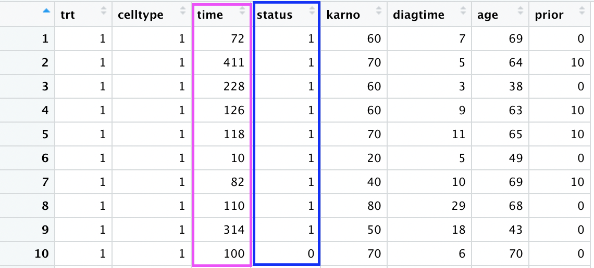
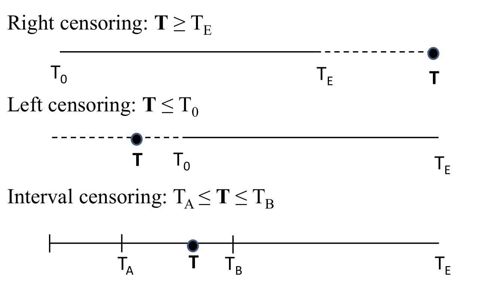
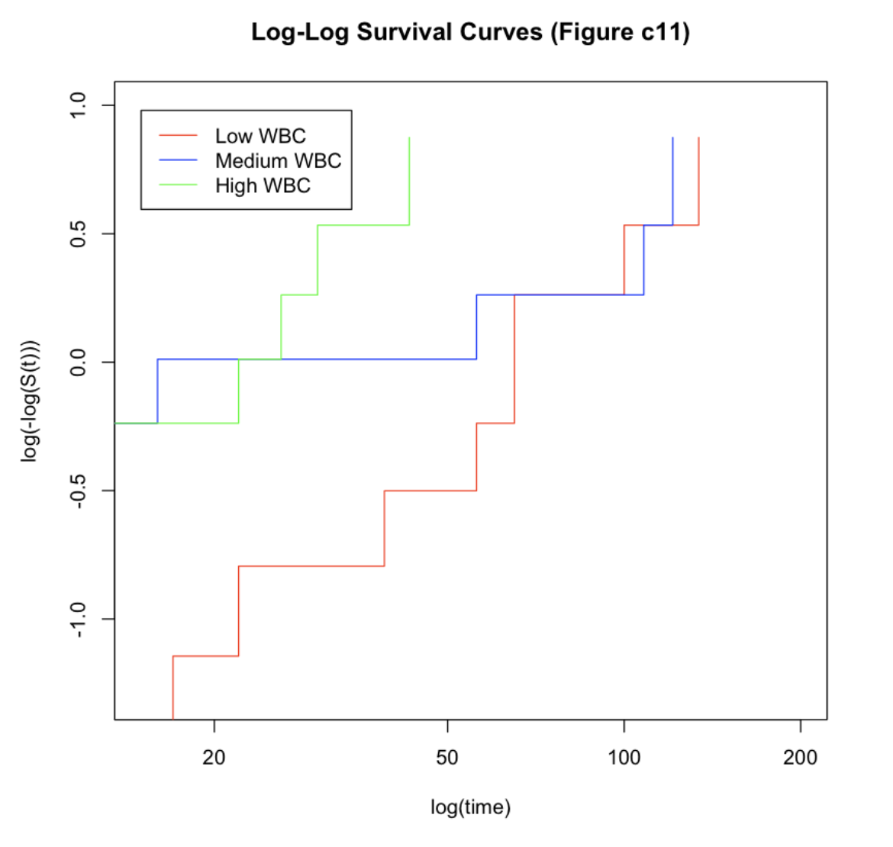
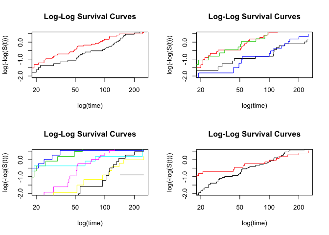
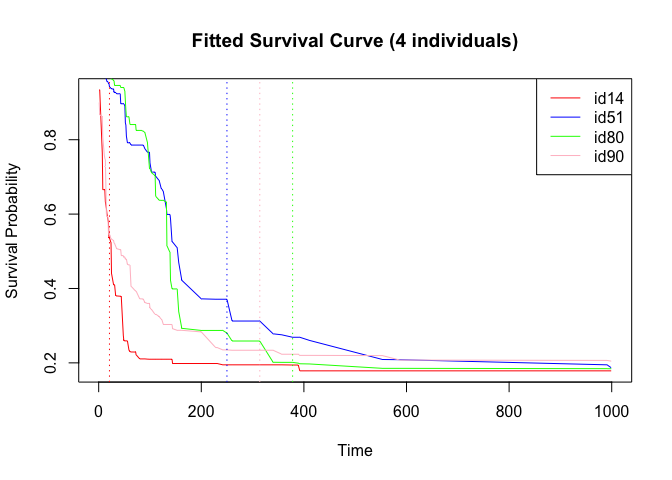
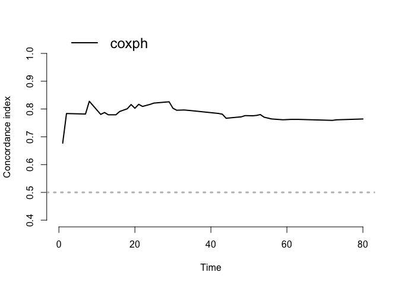

# Survival Analysis

Suppose there is a new drug M for treating heart disease, we want to explore whether this drug can improve a patient's index (such as survival time). Then the simplest idea is to randomly divide the patients into two groups: group A or group B, with group A given the drug and group B given the placebo. The average survival time of group A and group B were detected at the end. If group A is better than group B as a whole (e.g. using t-test), we think the drug is effective.

However, things don't always go our way.  If an old lady in group A unfortunately died in a car accident during treatment (e.g. three months after starting treatment), and an old gentleman's family in group B disagreed to continue treatment (e.g. five months after starting treatment) and terminate it, what impact would this have on our data?
Because the t-test needs to find the average of the two sets of data, and what number should we use for the old lady who has a car accident? Three months? This is rather unscientific.

However, it would be very unwise to delete it. Because it would make us lose some information. The three months gave us the message: the old lady lived for at least three months! If you delete this record, you lose the whole data. Consider an extreme case: what if all the samples in the data set were like this? Blind deletion will definitely increase the variance of the model and reduce the estimation accuracy.

So how do you make sense of such data? We need survival analysis to deal with this kind of special time data which may have partial censored data. In this project we will introduce some traditional survival analysis methods and focus on a different method from the traditional method: Random Survival Forest (RSF). 

## Survival Data

-   Goal:
    -   Assess the effect of risk factors on survival time - time until
        an event occurs, for example, death, diagnosis recovery, etc.
    -   Estimate and interpret survival
    -   Compare survival time / curve between groups
-   Outcome:
    -   The outcome of interest is a combination of continuous variable
        represents time to event and a binary variable represents
        censoring status: Y = \[T, C\]  
    -   T: Observed survival time
    -   C: Censoring (or event) status
-   Data snapshot:

## Censoring

Consider *Y**i*, *U**i* where *T**i* is
the time to event and *U**i* is time to censoring, i.e. end
of follow up period. We can only observe the minimum of the two time,
whichever comes the first,
*T**i* = *m**i**n*(*Y**i*,*U**i*).
Hence the actual exact survival time (T) is usually unknown, mainly due
to that the follow-up period is limited. Some instances are like when
there is no event happened up to the end of the follow-up period,
researchers lose contact with the patient, patient withdrawal
participation, or the exact date of the event is unknown. So we would
use censoring to account for the missing data issue. There are three
types of censoring:

-   Right censoring: *T* ≥ *T**E* Event happened after study
    period
-   Left censoring: *T* ≤ *T*0 Event happened before study
    period
-   Interval censoring: *T**A* ≤ *T* ≤ *T**B* Only
    know event time interval but don’t know the exact time

T: actual survival time  
*T*0: Start of study period  
*T**E*: End of study period

 *Image credit to
PHP2514 course material, Dr. Chrysanthopoulou*

For the Random Survival Forest method, we mainly focus on the
right-censoring data.

## Hazard Function

Survival analysis involves three characteristic functions: survival
function, hazard function, and cumulative hazard function, of which we
can derive all three given any one of the functions. The random survival
forest algorithm uses the cumulative hazard function. Hazard function
and cumulative hazard function are written as:

Hazard function (hazard rate): instantaneous potential per unit time for
the event to occur at time t, given survival up to time t:

<!-- $$h(t) = lim \Delta t \rightarrow 0 : \frac {P(t\leq T<t+\Delta t|T\geq t)} {\Delta(t)}$$ -->

 *Image credit to
PHP2514 course material, Dr. Chrysanthopoulou*

Cumulative Hazard Function: integrate hazard function h(t) from time 0
to time t

*H*(*t*) = ∫0*t**h*(*u*) *d**u*

# Regression Models for Survival Data

## Cox Porportional Hazards Model (semi-parametric)

-   Y: \[T, C\]
    -   T: Observed survival time
    -   C: Censoring (or event) status
-   Hazard rate:

Assume *h*0(*t*) as fixed and *X**j* are
**time-independent**:

## PH assumption

Cox proportional hazards model is usually used for right censored
time-to-event data. Mode is convenient for flexibility and simplicity,
but it’s restricted to *proportional hazards (PH) assumptions*, which is
to assume hazard ratio as independent of time t (constant over time). In
other words, the hazard rate at any time point t for a set a covariate
X\* is **proportional** to the hazard rate at the same time point t for
other set of covariate X.

Hazard Ratio *θ* is defined as:

Graphically, this is represented as roughly parallel survival curves
between different categories of a covariate. For example, the graph
below shows parallel pattern between high and low WBC, but non-parallel
between medium and the others.

## Survival Trees as alternative to Cox PH

When PH assumption is violated, which is most of the cases for real life
data, we turn to survival trees and Random survival forest (RSF) models
as alternative methods to the Cox PH model. [BMC Medical paper] (<https://bmcmedresmethodol.biomedcentral.com/articles/10.1186/s12874-017-0383-8>)

In contrast of the semi-parametric Cox PH model, survival trees is a
fully *non-parametric* method, which is much more flexible and can
easily handle high dimensional covariate data. And it can automatically
detect certain types of **interactions** without the need to specify
them beforehand. However, the drawback of survival trees is that it
tends to be biased towards inclusion of variables with many split
points.

### Conditional Inference Forest (CIF)\*:

Conditional Inference Forest could be used as an alternative to survival
trees and is able to avoid the bias towards selecting variables with
many split points. CIF corrects bias by y separating the algorithm for
selecting the best covariate to split on from that of the best split
point search. Nasejje et.al have a more comprehensive discussion about
comparing the methods in [this
paper](https://bmcmedresmethodol.biomedcentral.com/articles/10.1186/s12874-017-0383-8)

------------------------------------------------------------------------

# Survival Random Forest

Idea: partitioning the covariate space recursively to form groups of
subjects who are similar according to the time-to-event outcome.
Minimizing a given impurity measure. Goal: To identify prognostic
factors that are predictive of the time-to-event outcome.

## 1. Introduction

Random survival forest (RSF) is a random forest method used to analyze right deletion survival data. It introduces new survival splitting rules for growing survival trees and new missing data algorithms for estimating missing data.

RSF introduced the event retention principle for living forests and used it to define overall mortality, which is a simple interpretable mortality measure that can be used as a predictive result. 

## 2. RSF framework

1.  Extract *B* bootstrap samples from the original data, and each
    bootstrap sample excludes 37% of the data on average, which is
    called out-of-bag data (OOB data).

2.  Construct a binary survival tree for each bootstrap sample. At each
    node of the tree, p candidate variables are randomly selected, and
    the node is split by using the candidate variables that maximize the
    survival difference between the child nodes.

3.  Grow the tree to full size with at least *d*0 &gt; 0
    number of events (deaths).

4.  Calculate cumulative risk function for each tree and obtain the mean
    value of the integrated cumulative risk function.

5.  Calculate the integrated cumulative risk function prediction error
    with OOB data.

## 3. Ensemble cumulative hazard

Regenerating the survival tree and building the integrated CHF
(Cumulative Hazard Function) are the central elements of the RSF
algorithm.

### Binary Survival tree

Like CART, a survival tree is a binary tree generated by recursively
splitting tree nodes. A tree grows from the root node, which is the top
of the tree that contains all the data. Using predetermined survival
criteria, the root node is divided into two children: left and right. In
turn, each child node is split, producing left and right child nodes
with each split. The process is repeated recursively for each subsequent
node.

A good node segmentation can maximize the survival difference between
the offspring. The optimal split for a node can be found by searching
all possible x variables and split values c and selecting the x and c
that maximize the survival difference. By maximizing survival
differences, trees separate out different situations. Eventually, as the
number of nodes increased, the alien cases were separated, and each node
in the tree became homogenous, made up of samples with similar survival
rates.

### Node Segmentation Rules

At each node, a predictive variable *x* and a partition value *c* are
randomly selected, *c* being some value of *x*. If
*x**i* &lt; *c*, then the sample *i* is divided into the
right child node; If *x**i* &gt; *c*, the sample *i* is
assigned to the left child node.

Calculate log rank test:

=\frac{\sum\limits_{i=1}^{N}(d_{i,1}-Y_{i,1}\frac{d_{i,1}}{Y_{i,1}})}{\sqrt{\sum\limits_{i=1}^{N}\frac{Y_{i,1}}{Y_{i}}(1-\frac{Y_{i,1}}{Y_{i}})\frac{Y_{i}-d_{i}}{Y_{i}-1}d_{i}}})

Where, *j* = 1, 2 represents left and right child nodes,

*d**i*, *j* is the number of events occurring in the sub-node
*j* at the time *t**i*,

*Y**i*, *j* is the number of all patients in the sub-node *j*
at the moment *t**i*,

*d**i* is the number of default events occurring at the time
*t**i*,
*d**i* = ∑*j**d**i*, *j* ,

*Y**i* is the number of all borrowers at the moment
*t**i*,
*Y**i* = ∑*j**Y**i*, *j* .

Iterate over all possible variables *x* and partition values *c*, find
variables *x* and partition values *c* that satisfies

|*L*(*x*\*,*c*\*)| ≥ |*L*(*x*,*c*)|

for all *x*\* and *c*\*.

### Leaf node prediction

Eventually, the survival tree reaches a saturation point at which no new
child nodes can be formed, because each node must contain at least
*d*0 &gt; 0 of unique death criteria. The last node in a
saturated tree is called a leaf node, denoted by *H*.

Let
(*T*(1,*h*),*δ*(1,*h*)),…,(*T*(*n*(*h*),*h*),*δ*(*n*(*h*),*h*))
represent the sample survival time and 0-1 deletion information at the
leaf node *h* ∈ *H*. *δ**i*, *h* = 0 represents the right
deletion of sample *T**i*, *h* at moment *i*;
*δ**i*, *h* = 1 indicates that the sample
*T**i*, *h* occurs at time *i*.

*t*1, *h* &lt; *t*2, *h* &lt; ⋯ &lt; *t**N*(*h*), *h*
represents *N*(*h*) different moments when the event occurs;
*d**l*, *h* represents the number of deaths at the time
*t**l*, *h*; *Y**l*, *h* represents the number of
people who are alive at the moment *t**l*, *h*; The
cumulative risk function of the leaf node *h* is estimated as
Nelson-Aalen estimate:

 
The cumulative risk function is the same for all samples in the leaf
node *h*. Each sample *i* has the d-dimension covariant
*X**i*, and *H*(*t*│*X**i*) represents the
cumulative risk function of sample *i*, and we have:

We have an example here to make our audience clear:

We have a table below:

In the table above, *i* represents patient *i*, *t**i*
represents survival time of patient *i*, where 27+ indicates that the
patient exited at moment 27, which belongs to deletion, and it is not
known how long the patient survives.

*t**i* from small to large order is 5, 27+, 30, 32, 35, 35,
40, then:

Those who survive to time 5 was *i* = 1, 2, 3, 4, 5, 6, people who died
at time 5 was *i* = 6;

Those who survive to time 30 was *i* = 1, 2, 4, 5, people who died at
time 30 was *i* = 4;

Those who survive to time 32 was *i* = 1, 2, 5, people who died at time
32 was *i* = 2.

So, we have the Nelson-Aalen estimate at time 33:

<!-- 
 -->
 
### Bootstrap and OOB integrate cumulative risk functions

The cumulative risk function:

We got above is derived only from a single tree, and we need to
calculate the integrated cumulative risk function based on the mean of
total *B* survival trees.

Assume that the cumulative risk function of the growth tree of the
bootstrap sample *b* is *H**b*\*(*t*|*X*).

And we also assume that *I**i*, *b* = 1 indicates that *i* is
a case in *b*th bootstrap sample, otherwise *I**i*, *b* = 0.

The integrated cumulative risk function of the ith sample from OOB
(out-of-bag) is:

<!-- 
 -->
 
And the integrated cumulative risk function of the ith sample from IB
(in-bag) is:

<!-- 
 -->
 
## 4. Ensemble mortality

In the Random Survival Forest, mortality is defined as the sum of
expected value of the cumulative risk function over time
*T**j*, subject to a specific *X**i*. Under the
null hypothesis of similar survival behavior, it measures the expected
number of deaths. Specifically, the mortality rate of *i* is:

<!--  -->

where *E**i* represents the expectation given the null
hypothesis that all *j* are similar to *i*.

Mortality can be estimated naturally in the survival tree model. The
structure of survival tree enforces a null assumption that there are
similar survival rates in its leaf nodes; Individuals within leaf nodes
share a common estimated risk function. Thus, the nature of the survival
tree and its integration indicates an estimate of mortality, which we
call the ensemble mortality. The integrated mortality rate of the sample
*i* from IB (in-bag) is defined as:

<!-- 
 -->

Similarly, the integrated mortality rate from the OOB sample *i* is
defined as:

<!-- 
 -->
 
## 5. Harrell’s C-index

The intuition behind Harrell’s C-index is as follows. For patient *i*,
our risk model assigns a risk score *η**i*. If our risk model
is any good, patients who had shorter times-to-disease should have
higher risk scores. Boiling this intuition down to two patients: the
patient with the higher risk score should have a shorter
time-to-disease.

We can compute the C-index in the following way: For every pair of
patients *i* and *j* (with *i* ≠ *j*), look at their risk scores and
times-to-event.

1.  If both *T**i* and *T**j* are not censored,
    then we can observe when both patients got the disease. We say that
    the pair (*i*,*j*) is a concordant pair if and
    *T**i* &lt; *T**j*, and it is a discordant
    pair if *η**i* &gt; *η**j* and
    *T**i* &gt; *T**j*.

2.  If both *T**i* and *T**j* are censored, then
    we don’t know who got the disease first (if at all), so we don’t
    consider this pair in the computation.

3.  If one of *T**i* and *T**j* is censored, we
    only observe one disease. Let’s say we observe patient *i* getting
    disease at time *T**i*, and that *T**j* is
    censored. (The same logic holds for the reverse situation.)

4.  If *T**i* &gt; *T**j*, then we don’t know for
    sure who got the disease first, so we don’t consider this pair in
    the computation.

5.  If *T**i* &lt; *T**j*, then we know for sure
    that patient *i* got the disease first. Hence, (*i*,*j*) is a
    concordant pair if *η**i* &gt; *η**j*, and is
    a discordant pair if *η**i* &lt; *η**j*.

Thus we have C-index here:

<!-- 
 -->
 
Values of*C* near 0.5 indicate that the risk score predictions are no
better than a coin flip in determining which patient will live longer.
Values near 1 indicate that the risk scores are good at determining
which of two patients will have the disease first. Values near 0 means
that the risk scores are worse than a coin flip: you might be better off
concluding the opposite of what the risk scores tell you.

### Harrell’s C-index for continuous data

Of course, one can compute the C-index if none of the data is censored.
In that case, all pairs such that *T**i* ≠ *T**j*
will be included in the computation.

### Harrell’s C-index for binary data

The concept of the C-index can be easily ported over to binary data. In
this setting, a high-risk score prediction means more likely to be 1
than a 0. We only consider pairs where subject *i*’s response is a 1 and
subject *j*’s response is a one. The pair is concordant if
*η**i* &gt; *η**j*, and discordant if
*η**i* &lt; *η**j*.

We also have an example below

We have Concordant pairs：(A,C) (A,E) (C,D) so we can calculate the
C-Index:

This means that the prediction is not much better than a random guess.

## 6. Criteria for variable selection

Since the random survival forest model selects many features of input data as its split nodes to build the model, the model retains miscellaneous variables. However, not all variables have positive significance in the process of model building. Therefore, through variable screening, we can understand the role of each variable in the process of model building. 

There are two methods to evaluate the importance of variables, namely VIMP (variable Importance) method and minimal depth method. The calculation principle of VIMP method is to put the out of bag data into the survival tree and make it randomly assigned to any child node. Then calculate the new total cumulative risk and VIMP is the difference between the original error rate and the new error rate. Therefore, the larger the VIMP is, the greater the impact of this variable on the accuracy of the model and the higher the importance of this variable. Different from VIMP, the minimum depth rule believes that the variable to be retained should be the variable that can distinguish the most data, namely the node closest to the root node. Therefore, the minimum depth method considers that variables with smaller values are more important to the model.

## 7. Some discussions

Compared with traditional survival analysis methods like Cox proportional risk regression, the prediction accuracy of random survival forest model is at least equal to or better than that of traditional survival analysis method. The advantage of the random survival forest model is that it is not constrained by the proportional hazard assumption, log-linear assumption, and other conditions. At the same time, the random survival forest has the advantages of the general random forest, which can prevent the over-fitting problem of its algorithm through two random sampling processes. In addition, random survival forest can also perform survival analysis and variable screening on high-dimensional data and can also be applied to analysis of competing risks. Therefore, the random survival forest model has more extensive research space.

It should be emphasized that although several literatures have shown that the accuracy of the random survival forest model is better than or at least equal to that of the traditional survival model, the traditional survival analysis method is still indispensable when the data meet the requirements of the traditional survival analysis. As an emerging method, random survival forest also has a defect: it is susceptible to outliers. When analyzing data with outliers, the prediction accuracy is slightly inferior to traditional survival analysis methods]. Cox proportional hazard regression model for survival data analysis is not only used for prediction, but also can be more convenient to give the relationship between variables and survival outcome, so it should be combined with the traditional survival analysis and random survival forest model cannot completely replace the traditional survival analysis model.

# Application in R

# Veteran Data

In this demo we’re using `veteran` data from `survival` package, which
records data of randomized trial of two treatment regimens for lung
cancer. For model fitting, we need `survival` library for cox ph model
and `ranger` library for random survival forest.

<table>
<caption>
Veteran Data
</caption>
<thead>
<tr>
<th style="text-align:left;">
Variable
</th>
<th style="text-align:left;">
Explanation
</th>
</tr>
</thead>
<tbody>
<tr>
<td style="text-align:left;">
trt:
</td>
<td style="text-align:left;">
1=standard 2=test
</td>
</tr>
<tr>
<td style="text-align:left;">
celltype:
</td>
<td style="text-align:left;">
1=squamous, 2=smallcell, 3=adeno, 4=large
</td>
</tr>
<tr>
<td style="text-align:left;">
time:
</td>
<td style="text-align:left;">
survival time
</td>
</tr>
<tr>
<td style="text-align:left;">
status:
</td>
<td style="text-align:left;">
censoring status
</td>
</tr>
<tr>
<td style="text-align:left;">
karno:
</td>
<td style="text-align:left;">
Karnofsky performance score (100=good)
</td>
</tr>
<tr>
<td style="text-align:left;">
diagtime:
</td>
<td style="text-align:left;">
months from diagnosis to randomisation
</td>
</tr>
<tr>
<td style="text-align:left;">
age:
</td>
<td style="text-align:left;">
in years
</td>
</tr>
<tr>
<td style="text-align:left;">
prior:
</td>
<td style="text-align:left;">
prior therapy 0=no, 10=yes
</td>
</tr>
</tbody>
</table>

First, we split data into training set and test set:

    library(survival)
    library(ranger)
    data(veteran)
    veteran <- data.table(veteran)
    vet = veteran
    # Next, we split the data in a training and test set.
    set.seed(123456)
    ind <- sample(1:nrow(veteran),round(nrow(veteran) * 0.7,0))
    veteran_train <- veteran[ind,]
    veteran_test <- veteran[!ind,]
    vet.tr = vet[ind,]
    vet.te = vet[-ind,]

Use Kaplan Meier Curve as a visual summary of the survival probability
between treatment groups:

    # plot survival curve:
    kmvet = survfit(Surv(time, status)~trt, data=vet)
    # km curve
    plot(kmvet, col=c('blue','red'), xlab='Time', ylab='Survival Probability', main='Kaplan Meier Curves')
    legend("topright", lwd = 1, col = c('blue','red'), cex=0.7, y.intersp = 0.5, legend = c('trt=1', 'trt=2'))
    abline(h=0.5,lty=3)

## Cox PH Model

We first fit a COX PH Model. Using backward selection, we found the
‘best’ variable to fit the data. However, the log-log survival curves
show non-parallel curves between variable groups. So the PH assumption
might be violated.

    coxm0 = coxph(Surv(time, status)~(celltype+trt+karno+diagtime+age+prior)^2, data=vet.tr, ties='breslow')
    # coxm1 = step(coxm0, direction = "backward")
    # model selected from backward selection
    coxm1 = coxph(formula = Surv(time, status) ~ celltype + trt + karno + diagtime + prior + 
        celltype:trt + trt:karno + trt:diagtime + trt:prior + karno:prior, data = vet.tr, ties = "breslow", x=TRUE)
    # summary(coxm1)
    # PH assumption: non-parallel, violated
    par(mfrow=c(2,2))
    sapply(list(vet.tr$trt, vet.tr$celltype, vet.tr$karno, vet.tr$prior), 
           function(var) plot(survfit(Surv(time, status) ~ var, data=vet.tr),
                              col=1:10,
                              fun="cloglog",
                              ylab='log(-log(S(t)))', 
                              xlab='log(time)',
                              xlim=c(20,250),
                              ylim=c(-2,0.5),
                              main='Log-Log Survival Curves')
    )

The goodness of fit test based on Schoenfeld Residuals is another way to
test the PH assumption, which is the null hypothesis. However, we can
see a lot of p values of less than 0.05, this validated our concern that
the proportional hazard assumption is violated.

    cox.zph(coxm1) 

    ##                 chisq df     p
    ## celltype     7.59e+00  3 0.055
    ## trt          3.78e-05  1 0.995
    ## karno        5.35e+00  1 0.021
    ## diagtime     3.28e-01  1 0.567
    ## prior        4.62e-01  1 0.497
    ## celltype:trt 8.14e+00  3 0.043
    ## trt:karno    1.57e+00  1 0.211
    ## trt:diagtime 7.50e-01  1 0.387
    ## trt:prior    8.58e-01  1 0.354
    ## karno:prior  8.44e-02  1 0.771
    ## GLOBAL       2.22e+01 14 0.074

## Random Survival Models

### Use ranger package to train the random survival models

Recall that in random forest, we need to find number of variables **mtry
** to randomly select from at each node. First, we find the optimal mtry
parameter that gives the smallest OOB error. Over 1000 iterations, m = 3
has the highest frequency of giving the smallest OOB error.

    par(mfrow=c(1,1))
    # I created a simple function to find best m:
    functune = function(m){
      sapply(1:6, function(m) ranger(Surv(time, status) ~ .,
                    data = veteran_train,
                    mtry = m,
                    verbose = TRUE,
                    write.forest=TRUE,
                    num.trees= 1000,
                    importance = 'permutation')$prediction.error)
    }
    # I commented out this line of code to save running time: 
    # findM = apply(replicate(100,functune()), 2, which.min)
    # save(findM, file='findM')
    load(file='findM')
    # m = 3 is the optimal m
    table(findM)

    ## findM
    ##  3  4  5  6 
    ## 35 29 20 16

So we fit random survival tree with m = 3.

    # fit random survival tree
    r_fit <- ranger(Surv(time, status) ~ .,
                    data = veteran_train,
                    mtry = 3,
                    verbose = TRUE,
                    write.forest=TRUE,
                    num.trees= 1000,
                    importance = 'permutation')

### Fitted Survival probability

The model gives the fitted survival probability in a table format, where
rows represent individual patient and columns represent event time
points, from beginning to the end. Below I’m showing a snapshot of the
fitted survival probability table.

    # distinct survival time in training data
    # r_fit$unique.death.times
    # fitted survival: survival probability
    # rows represent individual patient; columns represent event time points
    fit.surv = r_fit$survival
    fit.survdf = data.frame(fit.surv)
    colnames(fit.survdf) <- paste0('T',as.character(r_fit$unique.death.times))
    # write.csv(fit.survdf, file = 'fit.survdf.csv')
    # fit.survdf = read.csv('fit.survdf.csv')
    fit.survdf[1:5,1:6]

    ##          T1        T2        T7        T8       T11       T12
    ## 1 0.9803422 0.9615677 0.8959521 0.8084944 0.8072767 0.8072767
    ## 2 0.9903623 0.9903623 0.9877519 0.9212304 0.9201504 0.9014983
    ## 3 0.9552650 0.8765003 0.8644494 0.7720116 0.7649667 0.7594641
    ## 4 0.9934633 0.9868441 0.9661402 0.9604876 0.9604876 0.9553862
    ## 5 0.9600375 0.9600375 0.9297039 0.8834538 0.8834538 0.8828354

Then I sampled 4 individuals to plot fitted survival curve. Vertical lines are the corresponding actual event time of the four individuals.

    par(mfrow=c(1,1))
    set.seed(12345)
    individual = sample(1:dim(veteran_train)[1], 4)
    plot(r_fit$unique.death.times, fit.surv[individual[1],], type = 'l', col = 'red',xlab='Time', ylab='Survival Probability', main='Fitted Survival Curve (4 individuals)')
    lines(r_fit$unique.death.times,fit.surv[individual[2],], type = 'l', col = 'blue',xlab='Time', ylab='Survival Probability')
    lines(r_fit$unique.death.times,fit.surv[individual[3],], type = 'l', col = 'green',xlab='Time', ylab='Survival Probability')
    lines(r_fit$unique.death.times,fit.surv[individual[4],], type = 'l', col = 'pink',xlab='Time', ylab='Survival Probability')
    abline(v=veteran_train[individual,]$time, lty=3, col=c('red','blue','green','pink'))
    legend("topright", lwd = 1, col = c('red','blue','green','pink'),
           legend = c('id14', 'id51', 'id80', 'id90'))

    #covariate values of the four individuals:
    veteran_train[individual,] 

    ##    trt  celltype time status karno diagtime age prior
    ## 1:   2 smallcell   21      1    20        4  71     0
    ## 2:   1     large  250      1    70        8  53    10
    ## 3:   2     large  378      1    80        4  65     0
    ## 4:   1  squamous  314      1    50       18  43     0

### Variable Importance

The random survival forest model identified karno, celltype, and trt as
the three most important predictors of survival time.

    # r_fit$variable.importance
    # plot(r_fit$variable.importance)
    data.frame(r_fit$variable.importance) %>% arrange(desc(r_fit.variable.importance))

    ##          r_fit.variable.importance
    ## karno                 0.0873113429
    ## celltype              0.0240913985
    ## trt                   0.0051800025
    ## prior                -0.0004687483
    ## diagtime             -0.0032790188
    ## age                  -0.0061162517

Similarly, in Cox PH model, the interaction effects between treatment
and celltype, karno, diagtime, prior are significant, hence can be
considered as important in affecting survival probability.

    coxm1

    ## Call:
    ## coxph(formula = Surv(time, status) ~ celltype + trt + karno + 
    ##     diagtime + prior + celltype:trt + trt:karno + trt:diagtime + 
    ##     trt:prior + karno:prior, data = vet.tr, ties = "breslow", 
    ##     x = TRUE)
    ## 
    ##                            coef exp(coef)  se(coef)      z        p
    ## celltypesmallcell     -0.342321  0.710120  0.935734 -0.366  0.71449
    ## celltypeadeno         -0.023817  0.976464  1.372042 -0.017  0.98615
    ## celltypelarge         -1.396922  0.247357  1.090788 -1.281  0.20032
    ## trt                    1.917587  6.804519  0.947170  2.025  0.04291
    ## karno                  0.040146  1.040963  0.024005  1.672  0.09445
    ## diagtime              -0.019462  0.980727  0.048720 -0.399  0.68956
    ## prior                  0.595488  1.813916  0.146705  4.059 4.93e-05
    ## celltypesmallcell:trt  0.927787  2.528907  0.632186  1.468  0.14222
    ## celltypeadeno:trt      0.717517  2.049338  0.793709  0.904  0.36599
    ## celltypelarge:trt      1.221454  3.392115  0.675046  1.809  0.07038
    ## trt:karno             -0.037440  0.963252  0.013589 -2.755  0.00587
    ## trt:diagtime           0.039191  1.039969  0.034437  1.138  0.25510
    ## trt:prior             -0.119658  0.887224  0.058079 -2.060  0.03937
    ## karno:prior           -0.006995  0.993029  0.001771 -3.949 7.86e-05
    ## 
    ## Likelihood ratio test=75.39  on 14 df, p=2.01e-10
    ## n= 96, number of events= 90

### Model performance

To assess the model performance, I choose to predict proportional of
survival after 80 days: if survival probability of an individual is over
50% at time T, then he is predicted to be survived. The preidction
accuracy at time point 80 is 63%.

    preds <- predict(r_fit, veteran_test, type = 'response')$survival
    preds = data.frame(preds)
    colnames(preds) <- paste0('T',as.character(r_fit$unique.death.times))
    predEvent = preds$T80 > 0.5
    actualEvent = veteran_test$time >= 80
    accuracy = sum(predEvent==actualEvent)/length(actualEvent)
    table(predEvent, actualEvent)

    ##          actualEvent
    ## predEvent FALSE TRUE
    ##     FALSE    13   11
    ##     TRUE      4   13

    accuracy

    ## [1] 0.6341463

To generalize the performance result, I predicted survival rates for all
time points. Prediction accuracy is as below: Note that the x-axis
represents the time index, not the actual time point period.

    # predict more time point:
    # exrtact time integer from column names:
    times = as.numeric(substr(colnames(preds),start=2,5))
      
    predSurv = function(j){
      # predict survival status:
      predEvent = preds[,j] > 0.5
      actualEvent = veteran_test$time >= times[j]
      # return confusion matrix and accuracy
      return(list(table(predEvent, actualEvent),
                  sum(predEvent==actualEvent)/length(actualEvent)))
    }
    # apply the prediction to all time points:
    accuracy_list = sapply(1:dim(preds)[2], function(j) predSurv(j)[[2]])
    # plot accuracy
    plot(accuracy_list,type='o',pch=16, main='Prediction accuracy by time', xlab='Time Index', ylab='Accuracy')

### C-Index

Additionally, we can use C-Index as metric for model performance. For
Cox PH model, we can calculate C-Index using `pec` library. For random
survival forest model, `ranger` compute Harrell’s c-index as a similar
measure to the Concordance statistic. And the Harrell’s c-index would be
1 - Prediction Error, according to Rickert’s discussion.
(*<https://rviews.rstudio.com/2017/09/25/survival-analysis-with-r/>*)

#### Cox PH C-Index:

    library(pec)
    # install.packages('pec')
    cindexcox = pec::cindex(coxm1, 
                formula = Surv(time, status) ~ celltype + trt + karno + 
                  diagtime + prior + celltype:trt + trt:karno + trt:diagtime + 
                  trt:prior + karno:prior,
                data=vet.tr,
                eval.times=r_fit$unique.death.times) # evaluating all survival times
    plot(cindexcox, xlim=c(0,80))

#### Random Survival Forest Harrell’s c-index

Harrell’s c-index is calculated as below. More exploration will be
needed regarding the degree of similarity between Harrell’s c-index and
Concordance statistic, and calculation for more time points.

    1 - r_fit$prediction.error

    ## [1] 0.6899351

